# 实验一

[toc]

## 题目1-1 模块编程实验


## 实验目的 

1. 体会用户空间和系统空间。

2. 理解操作系统“宏内核”组织方式。

3. 学习模块操作(加载、卸载)。

## 实验内容 

1. 编写一个简单的模块，练习其加载、卸载操作。
2. 编写程序比较内核空间和用户空间下视图进行内核操作的后果。
3. 编写一个模块，进行系统核心寄存器数值的获取。

## 实验设计原理和步骤

### 实验a

引入必要的头文件，用c语言编写一个简单的模块并编译，含init_module、cleanup_module两个函数并在两个函数中添加printk语句。

使用insmod和rmmod命令加载和卸载模块，同时使用dmesg观察加载卸载时的输出内容。

### 实验b

首先编写用户空间程序试图读取寄存器CR3，然后通过编写模块并加载的方式读取寄存器CR3的值并作对比。

因为用户空间实际上不能读取寄存器CR3的值而内核空间可以，所以观察到前者失败而后者成功。

### 实验c

通过将加载的模块经mknod命令创建为字符设备的方式，在编写的运行在用户空间的程序中调用该字符设备实现对系统系统核心寄存器数值的获取。

## 实验结果及分析

### 实验a

编译完成

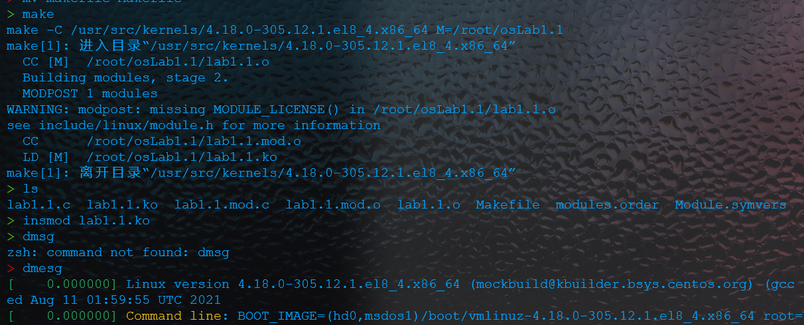

模块成功插入

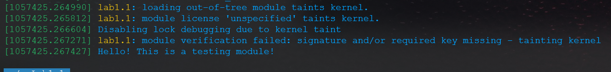

### 实验b

用户态程序运行时段错误


getCR3模块的输出和卸载


### 实验c

模块加载后dmesg输出

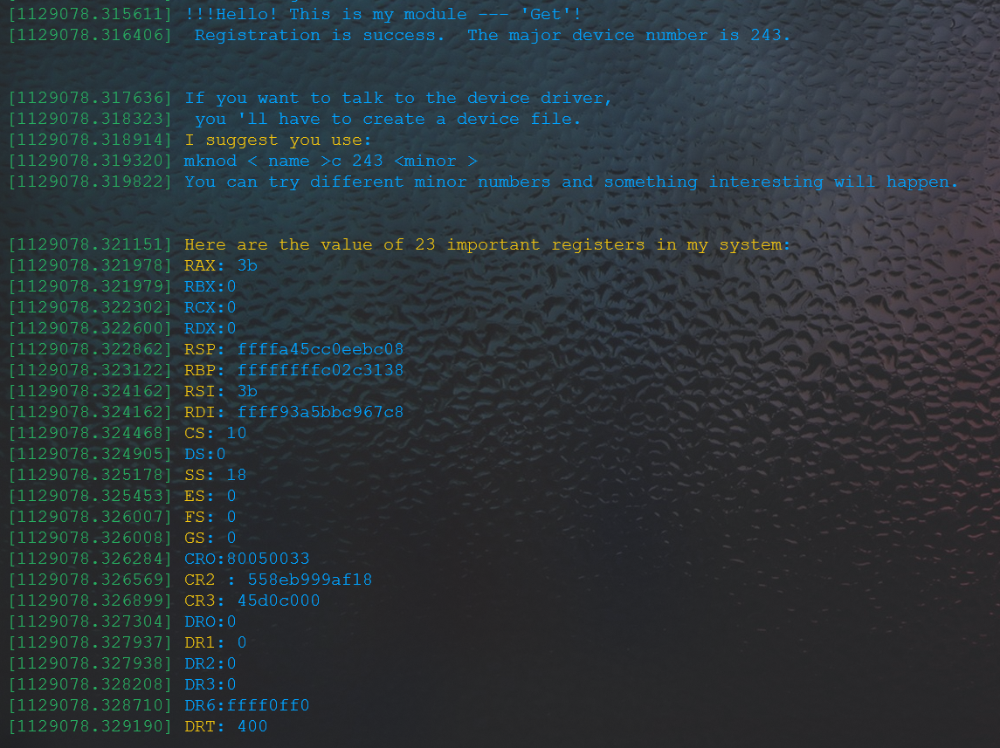

测试程序输出

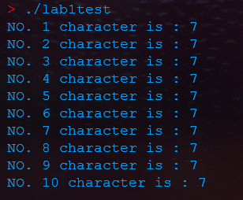

## 程序代码

### 实验a

 [lab1a.c](src1\lab1a.c) 

```c
#include<linux/kernel.h>
#include<linux/module.h>
int init_module()
{
printk ( "Hello! This is a testing module! \n" ) ;
return 0;
}
void cleanup_module()
{
printk ( "Sorry! The testing module is unloading now! \n" ) ;
}


```

### 实验b

 [lab1b.c](src1\lab1b.c) （模块编程）

```c
#include <linux/kernel.h>
#include <linux/module.h>
int init_module()
{
long iValue;
__asm__ __volatile__( "movq %%cr3,%0":"=r" ( iValue));
printk ( "cr3:%ld\n" , iValue) ;
return 0;
}
void cleanup_module(void){
printk ( "uninstall getcr3 ! \n" );
}

```


 [lab1b2.c](src1\lab1b2.c) （用户空间）

```c
#include <stdio.h>
//用户空间的标准输入输出头文件
void GetCr3( )
{
long iValue;
__asm__ __volatile__( "movq %%cr3,%0": "= r" ( iValue) ) ;
printf ( "the value in cr3 is: %d", iValue);
}

int main( )
{
GetCr3 ( );
return 0;
}

```


### 实验c

 [lab1c.c](src1\lab1c\lab1c.c) （模块编程）

```c
/*一些必要的头文件*/
//#include<include/stdio.h>
#include <linux/kernel.h>
# include <linux/module.h>
#include<linux/fs.h>
#include <asm/uaccess.h>

#define SUCCESS 0
#define DEVICE_NAME "get_dev"/*声明设备名,它会出现在/proc/devices中 */
#define BUF_LEN 100/*定义此设备消息缓冲的最大长度*/
static int Open_Get = 0;/*为了防止不同的进程在同一时间使用此设备,定义此静态变量*/
/*跟踪其状态*/
static char Message[ BUF_LEN];/*当提出请求时,设备将读写的内容放在下面的数组中*/
static char * Message_Ptr;/*在进程读取设备内容时,这个指针指向读取的位置*/
static int Major;/*主设备号作为全局变量以便该设备在注册和释放时使用*/

static int open_get( struct inode* inode,struct file * file)
{
	printk("AreUOK>>>>>>>>>>>>>>>>>>>>>>>>>>>>>>>>>>>>>>>>>>>>>>>>>>>>>");
	static int counter = 0 ;
	printk ( "This module is in open. \n" );
	#ifdef DEBUG
	printk ( " open_get( %p,%p)n", inode,file) ;
	#endif
	/*显示驱动模块的主设备号和次设备号*/
	printk( "Device: %d. %d\n", inode-> i_rdev >> 8,inode -> i_rdev & 0xFF);
	/*这个设备是一个独占设备,采取一定的措施避免同时有两个进程使用这个设备*/
	if( Open_Get)
	return -EBUSY;
	Open_Get++;
	/*初始化信息,注意不要使读写内容的长度超过缓冲区的长度,特别是运行内核模式时,否则
	如果出现缓冲上溢则可能导致系统崩溃,因此在测试程序Test.c中只读取了10个字符*/
	sprintf(Message, "If I told you once,I told you %d times - %s" , counter++,"Helo, world\n " );
	Message_Ptr = Message;
	/*当这个文件被打开的时候,必须确认该模块没有被移走,然后增加此模块的用户数目,与
	release函数中的 module_put(THIS_MODULE);语句相对应。在执行cleanup_module()函数移去模块时,根据这个数目决定是否可移去,如果不是О则表明还有进程在使用这个模块,不能移走*/
	try_module_get ( THIS_MODULE) ;
	return SUCCESS;
}

static int release_get(struct inode* inode,struct file* file)
{
	printk ( "This module is in release! \n" );
	#ifdef DEBUG
	printk ( "release_get( %p,%p)\n" ,inode , file);
	#endif
	Open_Get --;
	/*为下一个使用这个设备的进程做准备*/
	/*减少这个模块使用者的数目,否则将使得模块使用者的数目永远不会为0,就永远不能释放
	这个模块。与open()函数中的 try_module_get(THIS_MODULE);这条语句相对应*/
	module_put ( THIS_MODULE);
return 0;
}

static ssize_t read_get( struct file* file,
char* buffer,/*把读出的数据放到这个缓冲区,Test.c调用此函数时为数组 buf[ ] */size_t length,/*缓冲区的长度,test.c调用此函数时赋值为10 */
loff_t* offset)/*文件中的偏移*/
{
	int i, bytes_read = 0;/* i用于后边的循环, bytes_read是实际读出的字节数*/
	/*验证buffer是否可用*/
	if (access_ok ( /*VERIFY_WRITE,*/buffer,length)== -EFAULT)
		return -EFAULT;
	/*把用户的缓冲区全部写7,当然也可以写其他数字*/
	 for(i = length;i > 0 ;i-- )
	{
	/*调用read()函数时,系统进入核心态,不能直接使用buffer这个地址,必须用__put_user( ),
	这是kernel提供的一个函数,用于向用户传送数据。注意,有的内核版本中这个函数是3个参数*/
	__put_user( 7,buffer) ;
	buffer ++;
	/*地址指针向后移一位*/
	bytes_read ++;
	/*读取的字节数增加1*/
	printk( "Reading NO.%d character! \n" , bytes_read) ;
	}
return bytes_read;/*read()函数返回一个真正读出的字节数*/
}

static ssize_t write_get ( struct file* file,const char* buffer, size_t length, loff_t*offset)
{return length;}


static struct file_operations Fops_Get={
.read=read_get,
.write=write_get,
.open= open_get,
.release= release_get,
};


void cleanup_module()
{
printk ( "Uninstall 'Get' ! Thanks you ! \n" );
/*取消设备文件的注册。被调用执行后可在/proc/devices里看到效果*/
unregister_chrdev ( Major,DEVICE_NAME);
}

int init_module()
{
	printk("are you ok ????????????????????????????");
/*定义了23个整型变量用以存放寄存器的数值,并在模块加载时显示在屏幕上*/
long long iValue01,iValue02,iValue03,iValue04,iValue05, iValue06,
iValue07,iValue08,iValue09,iValue10,iValue11,iValue12,
 iValue13,iValue14,iValue15,iValue16,iValue17, iValue18,
 iValue19,iValue20,iValue21,iValue22,iValue23;
printk ( "!!!Hello! This is my module --- 'Get'! \n");
/*注册字符设备,注册后在/proc/devices 中可以看到这个字符设备的主设备号*/
Major = register_chrdev(0,DEVICE_NAME,&Fops_Get) ;
/*异常处理*/
if(Major < 0){
printk(" %s device failed with %d\n", "Sorry, registering the character" ,Major) ;
return Major;
}
/*一些提示信息,由于在虚拟机中编程时无法使用中文,所以使用英文提示*/
printk( " %s The major device number is %d.\n\n\n","Registration is success. " ,Major);
printk( "If you want to talk to the device driver, \n" );
printk ( " you 'll have to create a device file.\n" ) ;
printk( "I suggest you use: \n" ) ;
printk ( "mknod < name >c %d <minor >\n",Major) ;
printk( "You can try different minor numbers %s" , "and something interesting will happen.\n\n\n" ) ;
printk ( "Here are the value of 23 important registers in my system: \n" );
__asm__ __volatile__ ( "movq %%rax,%0" :"= r" ( iValue01 ) ) ;
__asm__ __volatile__ ( "movq %%rbx,%0":"=r" ( iValue02) ) ;
__asm__ __volatile__ ( "movq %%rcx,%0":"= r" ( iValue03 ) ) ;
__asm__ __volatile__ ( "movq %%rdx,%0":"= r" ( iValue04) ) ;
__asm__ __volatile__ ( "movq %%rsp,%0":"= r" ( iValue05)) ;
__asm__ __volatile__ ( "movq %%rbp,%0":"= r" (iValue06) ) ;
__asm__ __volatile__ ( "movq %%rsi,%0":"= r" ( iValue07) ) ;
__asm__ __volatile__ ( "movq %%rdi, %0":"= r" (iValue08) );
__asm__ __volatile__ ( "movq %%cs,%0":"= r" (iValue09) );
__asm__ __volatile__ ( "movq %%ds, %0":"= r" ( iValue10) ) ;
__asm__ __volatile__ ( "movq %%ss,%0":"= r" ( iValue11) );
__asm__ __volatile__ ( "movq %%es,%0" :" = r" ( iValue12));
__asm__ __volatile__ ( "movq %%fs, %0":"= r" (iValue13) ) ;

__asm__ __volatile__ ( "movq %%gs,%0":"= r" (iValue14));
__asm__ __volatile__ ( " movq %%cr0,%0":"= r" ( iValue15) ) ;
__asm__ __volatile__ ( "movq %%cr2,%0":"= r" ( iValue16) );
__asm__ __volatile__ ( "movq %%cr3,%0":"= r" ( iValue17)) ;
__asm__ __volatile__ ("movq %%dr0, %0":"= r" ( iValue18) ) ;
__asm__ __volatile__ ( "movq %%dr1,%0":"= r" (iValue19) );
__asm__ __volatile__ ( "movq %%dr2,%0" :"= r" ( iValue20 ) ) ;
__asm__ __volatile__ ( " movq %%dr3,%0":"= r" ( iValue21 ) ) ;
__asm__ __volatile__ ( "movq %%dr6,%0":"= r" ( iValue22) ) ;
__asm__ __volatile__ ( "movq %%dr7,%0":"= r" ( iValue23) ) ;
printk ( "RAX: %0llx ", iValue01 ) ;
printk ( "RBX:%0llx ", iValue02 ) ;
printk ( "RCX:%0llx ",iValue03 ) ;
printk ( "RDX:%0llx ",iValue04 ) ;
printk ( "RSP: %0llx ", iValue05 ) ;
printk ( "RBP: %0llx\n", iValue06 ) ;
printk ( "RSI: %0llx ", iValue07 ) ;
printk ( "RDI: %0llx ", iValue08 ) ;
printk ( "CS: %0llx ", iValue09 ) ;
printk ( "DS:%0llx ",iValue10 ) ;
printk ( "SS: %0llx ", iValue11 ) ;
printk ( "ES: %0llx\n", iValue12);
printk ( "FS: %0llx ", iValue13 ) ;
printk ( "GS: %0llx ", iValue14) ;
printk ( "CRO:%0llx ", iValue15) ;
printk ( "CR2 : %0llx ", iValue16 );
printk ( "CR3: %0llx ", iValue17);
printk ( "DRO:%0llx\n", iValue18) ;
printk ( "DR1: %0llx ", iValue19 ) ;
printk ( "DR2:%0llx ",iValue20 ) ;
printk ( "DR3:%0llx ", iValue21 ) ;
printk ( "DR6:%0llx ",iValue22) ;
printk ( "DRT: %0llx\n\n\n", iValue23);
return 0;
}


```


 [Makefile](src1\lab1c\Makefile) （对应的Makefile文件）

```makefile

ifneq ($(KERNELRELEASE),)
#kbuild syntax. dependency relationshsip of files and target modules are listed here
obj-m += lab1c.o

else
PWD :=$(shell pwd)
KVER ?=$(shell uname -r)
KDIR :=/usr/src1/kernels/$(KVER)
all:
	@echo $(MAKE) -C $(KDIR) M=$(PWD)
	@$(MAKE) -C $(KDIR) M=$(PWD)  modules
clean:
	@rm -rf . *.cmd *.o *.mod.c *.ko *.symvers *.ko.unsigned *.order
endif

```


 [lab1test.c](src1\lab1test.c) （用户空间测试文件）

```c
# include<stdio.h>
/*C程序必要的头文件*/
/*types.h头文件中定义了基本的数据类型。所有的类型定义为适当的数学类型长度。另外,size_
t是尤符号整数类型, off_t是扩展的符号整数类型, pid_t是符号整数类型。*/
#include <sys/types.h>
/*头文件stat.h说明了函数 stat()返回的数据及其结构类型,以及一些属性操作测试宏﹑函数原
型。*/
#include <sys/stat.h>
#include <stdlib.h>
/*exit()函数原型定义*/
#include <fcntl.h>
/*与文件操作相关*/
int main()
{
int i, testgetdev;
char buf[10];
/*字符数组，用于获取从read()写入的数据*/
testgetdev = open( "/dev/labc",O_RDONLY);/*打开前面所注册的设备文件*/
/*异常处理*/
if(testgetdev == -1) {
	printf ( "I Can't open the file! \n" );
	exit(0);
	}
/*调用read()函数,read()函数将10个字符7写入用户的缓冲区 buffer 数组*/
read(testgetdev,buf,10) ;
/*输出数组buffer */
for(i = 0; i<10; i++)
	printf( "NO. %d character is : %d\n",i+ 1, buf[ i]);
close(testgetdev) ;
/*事实上是调用release()函数关闭模块*/
return 0;
}


```

## 题目1-2 模块编程实验


## 实验目的 

1. 理解操作系统调用的运行机制。
2. 掌握创建系统调用的方法。

## 实验内容 

​		操作系统给用户提供了命令接口(控制台命令)和程序接口(系统调用)两种操作方式，实验通过向Linux内核添加多个自己设计的系统调用来理解系统调用的实现方法和运行机制。

## 实验设计

### 实验a

编写一个含printk语句的简单的系统调用到操作系统中。然后编写测试程序并使用dmesg观察加载卸载时的输出内容。

### 实验b

编写一个简单的系统调用，允许用户传入参数，在系统调用中计算后将结果返回给用户。然后编写测试程序观察返回结果是否符合预期（这里采用了一个简单的乘法运算）。

### 实验c

编写一个简单的系统调用，允许用户传入pid后查看/修改进程的priority值、nice值。然后编程测试程序观察运行是否符合预期。

## 实验步骤

### 下载合适的linux内核源码

这里下载的版本为 linux-4.19.25

### 注册系统调用

在文件syscall_32.tbl中（**实验环境是32位系统**）。

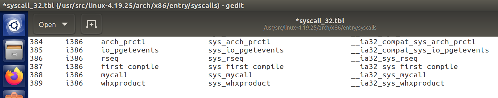

### 声明系统调用

在文件syscall.h中增加下列函数声明。

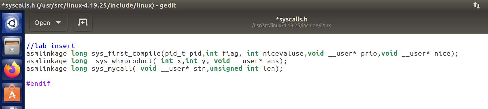

### 系统调用的定义

在文件sys.c中利用宏定义实现声明的系统调用函数。

定义要注意两点：

1. 不要写到某个#idndef和#endif中间区，否则可能不被编译。
2. 编写代码时注意用户空间的信息传递到内核空间（如mycall函数的str字符串）应当使用copy_from_user等函数，而不是直接使用用户空间的指针指向的内存，否则可能造成系统崩溃。
3. 编写代码时注意内核空间的信息传递到用户空间应当使用copy_to_user等函数（如whxproduct和first_compile中的传值），而不是直接写入到用户空间的指针指向的地址，否则可能造成系统崩溃。

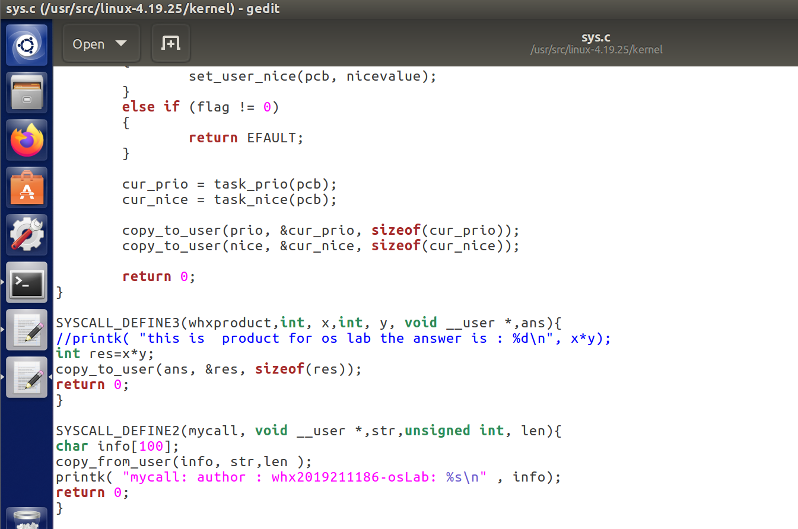

### 编译并重启操作系统，启用内核后编程测试

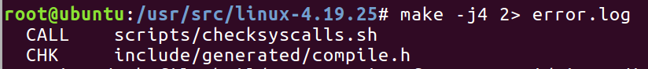

## 实验结果及分析

### 实验a

执行后有如下dmesg输出：

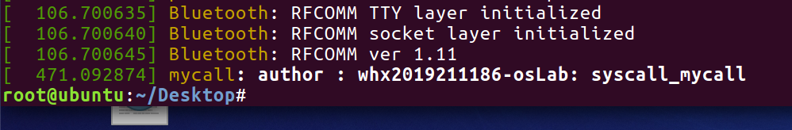

### 实验b

程序计算正确的乘法结果（302 2019211186是本人班级学号）

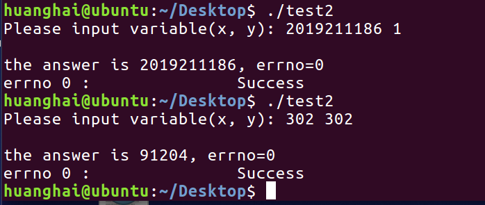

### 实验c

系统调用正确地读取、修改niceValue、priority

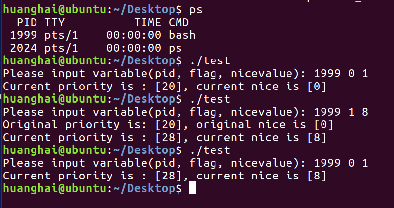

## 程序代码

### syscall.h中的声明 

### [syscalls.h](src2\syscalls.h) 

```c
asmlinkage long sys_first_compile(pid_t pid,int fiag, int nicevaluse,void __user* prio,void __user* nice);
asmlinkage long  sys_whxproduct( int x,int y, void __user* ans);
asmlinkage long sys_mycall( void __user* str,unsigned int len);
```

### sys.c中的实现

 [sys.c](src2\sys.c) 

```c
//实验b
SYSCALL_DEFINE3(whxproduct,int, x,int, y, void __user *,ans){
//printk( "this is  product for os lab the answer is : %d\n", x*y);
int res=x*y;
copy_to_user(ans, &res, sizeof(res));
return 0;
}
//实验a
SYSCALL_DEFINE2(mycall, void __user *,str,unsigned int, len){
char info[100];
copy_from_user(info, str,len );
printk( "mycall: author : whx2019211186-osLab: %s\n" , info);
return 0;
}
//实验c
SYSCALL_DEFINE5(first_compile, pid_t, pid, int, flag, int, nicevalue, void __user *, prio, void __user *, nice)
{
        int cur_prio, cur_nice;
        struct pid *ppid;
        struct task_struct *pcb;

        ppid = find_get_pid(pid);

        pcb = pid_task(ppid, PIDTYPE_PID);

        if (flag == 1)
        {
                set_user_nice(pcb, nicevalue);
        }
        else if (flag != 0)
        {
                return EFAULT;
        }

        cur_prio = task_prio(pcb);
        cur_nice = task_nice(pcb);

        copy_to_user(prio, &cur_prio, sizeof(cur_prio));
        copy_to_user(nice, &cur_nice, sizeof(cur_nice));

        return 0;
}
```


### 实验a测试程序

  [test3.c](src2\test3.c) 

```c
#include <unistd.h>
#include <sys/syscall.h>
#include <stdio.h>
#include <errno.h>
#include <string.h>
#define _SYSCALL_MYSETNICE_ 388
#define EFALUT 14

#include <string.h>
 
int main()
{
char * str="syscall_mycall";
int     res=syscall(_SYSCALL_MYSETNICE_,str,strlen(str)+1);
 printf("errno %d :\t\t%s\n",errno,strerror(errno));
return 0;
}
```

### 实验b测试程序

 [test2.c](src2\test2.c) 

```c
#include <unistd.h>
#include <sys/syscall.h>
#include <stdio.h>
#include <errno.h>
#define _SYSCALL_MYSETNICE_ 389
#define EFALUT 14

#include <string.h>
 
int main()
{
    int x,y;
    int result;

    printf("Please input variable(x, y): ");
    scanf("%d%d", &x, &y);
    int ans=0;
    result = syscall(_SYSCALL_MYSETNICE_, x,y,&ans);
    printf("\nthe answer is %d, errno=%d\n",ans,errno);
    printf("errno %d :\t\t%s\n",errno,strerror(errno));
    return 0;
}
```

### 实验c测试程序

 [test.c](src2\test.c) 

```c
#include <unistd.h>
#include <sys/syscall.h>
#include <stdio.h>
#define _SYSCALL_MYSETNICE_ 387
#define EFALUT 14

int main()
{
    int pid, flag, nicevalue;
    int prev_prio, prev_nice, cur_prio, cur_nice;
    int result;

    printf("Please input variable(pid, flag, nicevalue): ");
    scanf("%d%d%d", &pid, &flag, &nicevalue);

    result = syscall(_SYSCALL_MYSETNICE_, pid, 0, nicevalue, &prev_prio,
                     &prev_nice);
    if (result == EFALUT)
    {
        printf("ERROR!");
        return 1;
    }

    if (flag == 1)
    {
        syscall(_SYSCALL_MYSETNICE_, pid, 1, nicevalue, &cur_prio, &cur_nice);
        printf("Original priority is: [%d], original nice is [%d]\n", prev_prio,
               prev_nice);
        printf("Current priority is : [%d], current nice is [%d]\n", cur_prio,
               cur_nice);
    }
    else if (flag == 0)
    {
        printf("Current priority is : [%d], current nice is [%d]\n", prev_prio,
               prev_nice);
    }

    return 0;
}
```
