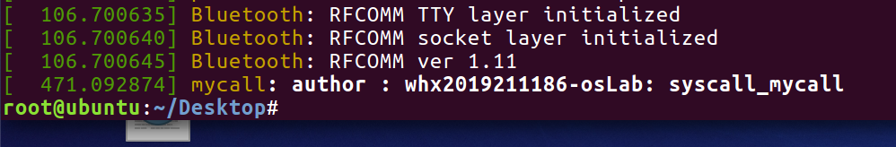
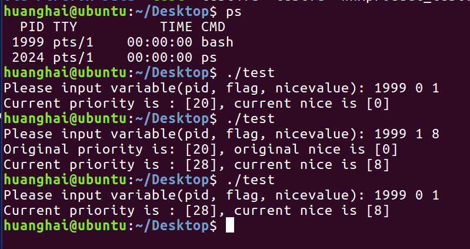

## 题目 模块编程实验


## 实验目的 

1. 理解操作系统调用的运行机制。
2. 掌握创建系统调用的方法。

## 实验内容 

​		操作系统给用户提供了命令接口(控制台命令)和程序接口(系统调用)两种操作方式，实验通过向Linux内核添加多个自己设计的系统调用来理解系统调用的实现方法和运行机制。

## 实验设计

### 实验a

编写一个含printk语句的简单的系统调用到操作系统中。然后编写测试程序并使用dmesg观察加载卸载时的输出内容。

### 实验b

编写一个简单的系统调用，允许用户传入参数，在系统调用中计算后将结果返回给用户。然后编写测试程序观察返回结果是否符合预期（这里采用了一个简单的乘法运算）。

### 实验c

编写一个简单的系统调用，允许用户传入pid后查看/修改进程的priority值、nice值。然后编程测试程序观察运行是否符合预期。

## 实验步骤

### 下载合适的linux内核源码

这里下载的版本为 linux-4.19.25

### 注册系统调用

在文件syscall_32.tbl中（**实验环境是32位系统**）。


### 声明系统调用

在文件syscall.h中增加下列函数声明。


### 系统调用的定义

在文件sys.c中利用宏定义实现声明的系统调用函数。

定义要注意两点：

1. 不要写到某个#idndef和#endif中间区，否则可能不被编译。
2. 编写代码时注意用户空间的信息传递到内核空间（如mycall函数的str字符串）应当使用copy_from_user等函数，而不是直接使用用户空间的指针指向的内存，否则可能造成系统崩溃。
3. 编写代码时注意内核空间的信息传递到用户空间应当使用copy_to_user等函数（如whxproduct和first_compile中的传值），而不是直接写入到用户空间的指针指向的地址，否则可能造成系统崩溃。


### 编译并重启操作系统，启用内核后编程测试


## 实验结果及分析

### 实验a

执行后有如下dmesg输出：



### 实验b

程序计算正确的乘法结果（302 2019211186是本人班级学号）


### 实验c

系统调用正确地读取、修改niceValue、priority



## 程序代码

### syscall.h中的声明 

### [syscalls.h](src2\syscalls.h) 

```c
asmlinkage long sys_first_compile(pid_t pid,int fiag, int nicevaluse,void __user* prio,void __user* nice);
asmlinkage long  sys_whxproduct( int x,int y, void __user* ans);
asmlinkage long sys_mycall( void __user* str,unsigned int len);
```

### sys.c中的实现

 [sys.c](src2\sys.c) 

```c
//实验b
SYSCALL_DEFINE3(whxproduct,int, x,int, y, void __user *,ans){
//printk( "this is  product for os lab the answer is : %d\n", x*y);
int res=x*y;
copy_to_user(ans, &res, sizeof(res));
return 0;
}
//实验a
SYSCALL_DEFINE2(mycall, void __user *,str,unsigned int, len){
char info[100];
copy_from_user(info, str,len );
printk( "mycall: author : whx2019211186-osLab: %s\n" , info);
return 0;
}
//实验c
SYSCALL_DEFINE5(first_compile, pid_t, pid, int, flag, int, nicevalue, void __user *, prio, void __user *, nice)
{
        int cur_prio, cur_nice;
        struct pid *ppid;
        struct task_struct *pcb;

        ppid = find_get_pid(pid);

        pcb = pid_task(ppid, PIDTYPE_PID);

        if (flag == 1)
        {
                set_user_nice(pcb, nicevalue);
        }
        else if (flag != 0)
        {
                return EFAULT;
        }

        cur_prio = task_prio(pcb);
        cur_nice = task_nice(pcb);

        copy_to_user(prio, &cur_prio, sizeof(cur_prio));
        copy_to_user(nice, &cur_nice, sizeof(cur_nice));

        return 0;
}
```


### 实验a测试程序

  [test3.c](src2\test3.c) 

```c
#include <unistd.h>
#include <sys/syscall.h>
#include <stdio.h>
#include <errno.h>
#include <string.h>
#define _SYSCALL_MYSETNICE_ 388
#define EFALUT 14

#include <string.h>
 
int main()
{
char * str="syscall_mycall";
int     res=syscall(_SYSCALL_MYSETNICE_,str,strlen(str)+1);
 printf("errno %d :\t\t%s\n",errno,strerror(errno));
return 0;
}
```

### 实验b测试程序

 [test2.c](src2\test2.c) 

```c
#include <unistd.h>
#include <sys/syscall.h>
#include <stdio.h>
#include <errno.h>
#define _SYSCALL_MYSETNICE_ 389
#define EFALUT 14

#include <string.h>
 
int main()
{
    int x,y;
    int result;

    printf("Please input variable(x, y): ");
    scanf("%d%d", &x, &y);
    int ans=0;
    result = syscall(_SYSCALL_MYSETNICE_, x,y,&ans);
    printf("\nthe answer is %d, errno=%d\n",ans,errno);
    printf("errno %d :\t\t%s\n",errno,strerror(errno));
    return 0;
}
```

### 实验c测试程序

 [test.c](src2\test.c) 

```c
#include <unistd.h>
#include <sys/syscall.h>
#include <stdio.h>
#define _SYSCALL_MYSETNICE_ 387
#define EFALUT 14

int main()
{
    int pid, flag, nicevalue;
    int prev_prio, prev_nice, cur_prio, cur_nice;
    int result;

    printf("Please input variable(pid, flag, nicevalue): ");
    scanf("%d%d%d", &pid, &flag, &nicevalue);

    result = syscall(_SYSCALL_MYSETNICE_, pid, 0, nicevalue, &prev_prio,
                     &prev_nice);
    if (result == EFALUT)
    {
        printf("ERROR!");
        return 1;
    }

    if (flag == 1)
    {
        syscall(_SYSCALL_MYSETNICE_, pid, 1, nicevalue, &cur_prio, &cur_nice);
        printf("Original priority is: [%d], original nice is [%d]\n", prev_prio,
               prev_nice);
        printf("Current priority is : [%d], current nice is [%d]\n", cur_prio,
               cur_nice);
    }
    else if (flag == 0)
    {
        printf("Current priority is : [%d], current nice is [%d]\n", prev_prio,
               prev_nice);
    }

    return 0;
}
```
