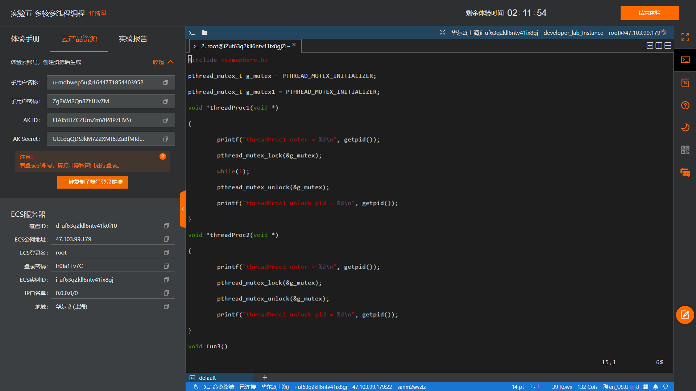
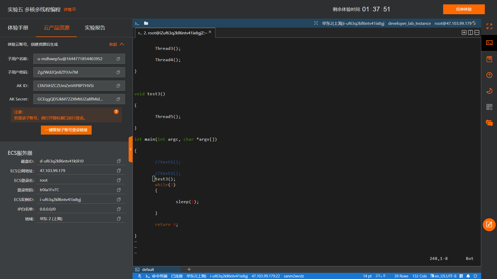

# **题目：死锁分析**

# 实验目的

编程实现多个并发进程/线程：进程/线程间采用锁机制，竞争使用临界资源导致死锁——由此分析死锁发生的原因。

# 实验内容

编程实现死锁发生的3种情况：回调接口卡导致锁等待、同线程多次锁操作、双线程交叉使用互斥锁，观察在gdb调试下的进程信息分析死锁产生的具体过程。

# 实验设计原理

死锁问题大概可以分为3种情况：

1. 接口卡主锁不能及时释放导致别的线程卡住，这类不算真正的死锁。
2. 同一个线程锁多次导致死锁。
3. 两个锁交叉使用导致死锁。

这三种情况的定位方法都是一样，都是根据锁的占有者顺藤摸瓜：比如线程1在等锁，必然有别的线程在占有锁，可以查看线程1所需求的锁的占有者找到线程2，以此类推，直到把锁的关系理清楚就知道死锁原因了。

# 实验步骤

* 将第一种情况回调接口卡导致锁等待封装于函数test1中，其依次调用线程1和线程2：前者获得互斥锁后进入无限循环而不再释放锁，后者为正常得到并释放锁的简单线程。

* 将第二种情况同线程多次锁操作封装于函数test3中，其调用线程5：其得到互斥锁后执行fun5再次请求锁，造成单线程中的自锁。

* 将第三种情况双线程交叉求锁封装于函数test2中，其依次调用线程3和线程4：前者得到锁0后进行一段休眠，之后执行fun3请求互斥锁1并释放最终释放初始锁0；后者得到锁1后执行fun4请求初始锁0并释放最终释放锁1。
编码并编译完成后分别执行各个test并使用gdb调试进行分析。

# 实验结果及分析

## 情况一


执行deadlock后根据输出观察到线程1和线程2均进入阻塞状态。结合代码可以推测线程1阻塞的原因是本身代码的死循环，同时占有了g_mutex；而线程2进入的时候需要等待g_mutex可用，而结果就是线程2一直阻塞在等待状态。通过gdb调试信息如下：


通过g_mutex信息可以观察到其占有者为11839，而堆栈显示序号为3的线程此时进入了lock_wait状态：线程11840，也就是上文中的线程2（图中序号为3）在持续等锁，然而其已经被线程11839（上文中的线程1，图中序号为2）占用，后者持续死循环而g_mutex不会被主动释放，在这段时间线程11840就在持续等待造成死锁现象。

## 情况二


执行deadlock后根据输出观察到线程5执行的fun5函数进入了死锁状态，调用gdb查看调试信息：

由g_mutex信息可观察到此时互斥锁的占有者就是唯一的线程12060本身，然而在fun5代码中其索求更多的同一互斥锁，而这是无法达成的，故引起单一线程自身的死锁。

## 情况三


根据输出可观察到线程3和线程4各自的执行函数均进入了死锁，在gdb调试信息中显示：

线程12272及线程12271同时处于lock_wait状态，而两个线程的堆栈信息所显示的状态基本一致。

对于两个g_mutex，其占有者不同，而彼此的占有者又试图进一步寻求另一mutex，由此造成了真正的死锁。

# 程序代码

```cpp
# include <stdio.h>
# include <stdlib.h>
# include <iostream>
# include <unistd.h>
# include <list>
# include <pthread.h>
# include <assert.h>
# include <semaphore.h>

pthread_mutex_t g_mutex = PTHREAD_MUTEX_INITIALIZER;
pthread_mutex_t g_mutex1 = PTHREAD_MUTEX_INITIALIZER;

void *threadProc1(void*)
{
    printf("threadProc1 enter = %d\n", getpid());
    pthread_mutex_lock(&g_mutex);
    while(1);
    pthread_mutex_unlock(&g_mutex);
    printf("threadProc1 unlock pid = %d\n", getpid());
}

void *threadProc2(void*)
{
    printf("threadProc2 enter = %d\n", getpid());
    pthread_mutex_lock(&g_mutex);
    pthread_mutex_unlock(&g_mutex);
    printf("threadProc2 unlock pid = %d\n", getpid());
}

void fun3()
{
    printf("fun3 begin\n");
    pthread_mutex_lock(&g_mutex1);
    pthread_mutex_unlock(&g_mutex1);
    printf("fun3 end\n");
}

void fun4()
{
    printf("fun4 begin\n");
    pthread_mutex_lock(&g_mutex);
     pthread_mutex_unlock(&g_mutex);
    printf("fun4 end\n");
}

void *threadProc3(void*)
{
    printf("threadProc3 enter = %d\n", getpid());
    pthread_mutex_lock(&g_mutex);
    sleep(1);
    fun3();
    pthread_mutex_unlock(&g_mutex);
    printf("threadProc3 unlock pid = %d\n", getpid());
}

void *threadProc4(void*)
{
    printf("threadProc4 enter = %d\n", getpid());
    pthread_mutex_lock(&g_mutex1);
    fun4();
    pthread_mutex_unlock(&g_mutex1);
    printf("threadProc4 unlock pid = %d\n", getpid());
}

void fun5()
{
    printf("fun5 begin\n");
    pthread_mutex_lock(&g_mutex);
    pthread_mutex_unlock(&g_mutex);
    printf("fun5 end\n");
}

void *threadProc5(void*)
{
    printf("threadProc5 enter = %d\n", getpid());
    pthread_mutex_lock(&g_mutex);
    fun5();
    pthread_mutex_unlock(&g_mutex);
    printf("threadProc5 unlock pid = %d\n", getpid());
}

void Thread1()
{
    pthread_t tid;
    pthread_create(&tid, NULL, threadProc1, NULL);
    pthread_detach(tid);
}

void Thread2()
{
    pthread_t tid;
    pthread_create(&tid, NULL, threadProc2, NULL);
    pthread_detach(tid);
}

void Thread3()
{
    pthread_t tid;
    pthread_create(&tid, NULL, threadProc3, NULL);
    pthread_detach(tid);
}

void Thread4()
{
    pthread_t tid;
    pthread_create(&tid, NULL, threadProc4, NULL);
    pthread_detach(tid);
}

void Thread5()
{
    pthread_t tid;
    pthread_create(&tid, NULL, threadProc5, NULL);
    pthread_detach(tid);
}

//回调接口卡主导致其他线程等锁

void test1()
{
    printf("test1 begin\n");
    Thread1();
    Thread2();
    printf("test1 end\n");
}

//两个锁交叉使用导致死锁

void test2()
{
    Thread3();
    Thread4();
}

//同一锁被一个线程锁多次

void test3()
{
    Thread5();
}

int main(int argc, char *argv[])
{
    test1();
    //test2();
    //test3();
    while(1)
    {
        sleep(1);
    }
    return 0;
}
```