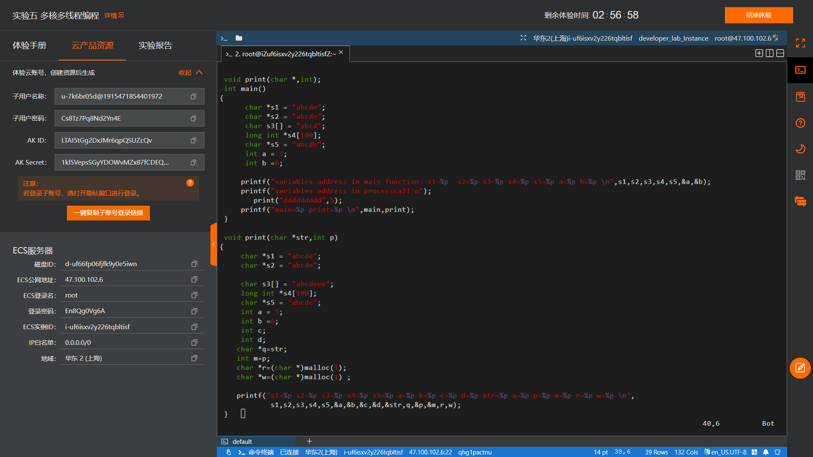
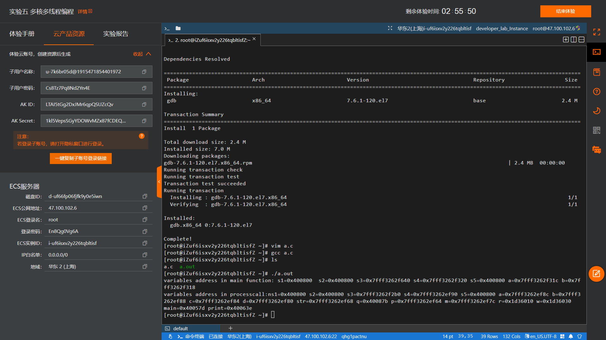

# **题目：内存管理——虚拟空间分布**

# 实验目的

了解Linux进程虚拟地址空间的组成。

# 实验内容

编写C语言程序，分配位于堆和栈上的变量，观察变量的地址分布和变化。

# 实验设计原理

* 进程空间主要由以下几个分布组成：
    * 程序段(Text):程序代码在内存中的映射，存放函数体的二进制代码。
    * 初始化过的数据(Data):在程序运行初已经对变量进行初始化的数据。
    * 未初始化过的数据(BSS):在程序运行初未对变量进行初始化的数据。
    * 栈 (Stack):存储局部、临时变量，函数调用时，存储函数的返回指针，用于控制函数的调用和返回。在程序块开始时自动分配内存,结束时自动释放内存，其操作方式类似于数据结构中的栈。
    * 堆 (Heap):存储动态内存分配,需要程序员手工分配,手工释放.注意它与数据结构中的堆是两回事，分配方式类似于链表。

* Linux的虚拟地址空间范围为0～4G，Linux内核将这4G字节的空间分为两部分，将最高的1G字节（从虚拟地址0xC0000000到0xFFFFFFFF）供内核使用，称为“内核空间”。而将较低的3G字节（从虚拟地址0x00000000到0xBFFFFFFF）供各个进程使用，称为“用户空间”。因为每个进程可以通过系统调用进入内核，因此，Linux内核由系统内的所有进程共享。于是，从具体进程的角度来看，每个进程可以拥有4G字节的虚拟空间。
* Linux使用两级保护机制：0级供内核使用，3级供用户程序使用，每个进程有各自的私有用户空间（0～3G），这个空间对系统中的其他进程是不可见的，最高的1GB字节虚拟内核空间则为所有进程以及内核所共享。内核空间中存放的是内核代码和数据，而进程的用户空间中存放的是用户程序的代码和数据。不管是内核空间还是用户空间，它们都处于虚拟空间中。虽然内核空间占据了每个虚拟空间中的最高1GB字节，但映射到物理内存却总是从最低地址（0x00000000）。另外， 使用虚拟地址可以很好的保护内核空间被用户空间破坏，虚拟地址到物理地址转换过程由操作系统和CPU共同完成(操作系统为CPU设置好页表，CPU通过MMU单元进行地址转换)。

* Linux进程标准的内存段布局除了用户不可见的内核虚拟存储器外，用户空间同样分为栈、堆、内存映射段、BBS和数据段以及Text。

# 实验步骤

编码定义字符指针s1、s2、s5均指向同一字符串”abcde”，定义字符串数组s3以及指向int型的指针数组s4，定义整型a=5、b=6。输出一次所有变量的地址后通过子函数将一串d作为参数压入栈并再次定义一遍同名变量并输出各个地址位置。最终输出主函数与子函数的地址。

# 实验结果及分析


首先观察主函数输出，发现指向同一字符串的指针数组地址均相同，而整型及其他数组的地址符合反向增长的规律；在子函数中指向同一字符串的指针数组地址仍与主函数相同，其他变量仍符合反向增长，唯独最后两个调用malloc赋值的变量指向地址正向增长。主函数的地址要低于后编译的子函数。

栈和堆是在程序运行时候动态分配的，局部变量均在栈上分配。 
栈是反向增长的，地址递减；malloc等分配的内存空间在堆空间。堆是正向增长的，地址递增。  
例如r,w变量在栈上(则&r>&w)，r,w所指内容在堆中(即r<w)。

# 程序代码

```cpp
#include<stdio.h>    
#include <malloc.h>    
     
void print(char *,int);    
int main()    
{    
    char *s1 = "abcde";  //"abcde"作为字符串常量存储在常量区 s1、s2、s5拥有相同的地址  
    char *s2 = "abcde";    
    char s3[] = "abcd";    
    long int *s4[100];    
    char *s5 = "abcde";    
    int a = 5;    
    int b =6;//a,b在栈上，&a>&b地址反向增长    
     
     printf("variables address in main function: s1=%p  s2=%p s3=%p s4=%p s5=%p a=%p b=%p \n",     
             s1,s2,s3,s4,s5,&a,&b);   
     printf("variables address in processcall:n");    
     print("ddddddddd",5);//参数入栈从右至左进行,p先进栈,str后进 &p>&str    
     printf("main=%p print=%p \n",main,print);    
     //打印代码段中主函数和子函数的地址，编译时先编译的地址低，后编译的地址高main<print    
}    
  
void print(char *str,int p)    
{    
    char *s1 = "abcde";  //abcde在常量区，s1在栈上    
    char *s2 = "abcde";  //abcde在常量区，s2在栈上 s2-s1=6可能等于0，编译器优化了相同的常量，只在内存保存一份    
    //而&s1>&s2    
    char s3[] = "abcdeee";//abcdeee在常量区，s3在栈上，数组保存的内容为abcdeee的一份拷贝    
    long int *s4[100];    
    char *s5 = "abcde";    
    int a = 5;    
    int b =6;    
    int c;    
    int d;           //a,b,c,d均在栈上，&a>&b>&c>&d地址反向增长    
    char *q=str;   
    int m=p;           
    char *r=(char *)malloc(1);    
    char *w=(char *)malloc(1) ;  // r<w 堆正向增长    
    
    printf("s1=%p s2=%p s3=%p s4=%p s5=%p a=%p b=%p c=%p d=%p str=%p q=%p p=%p m=%p r=%p w=%p \n",    
            s1,s2,s3,s4,s5,&a,&b,&c,&d,&str,q,&p,&m,r,w);   
    /* 栈和堆是在程序运行时候动态分配的，局部变量均在栈上分配。 
        栈是反向增长的，地址递减；malloc等分配的内存空间在堆空间。堆是正向增长的，地址递增。   
        r,w变量在栈上(则&r>&w)，r,w所指内容在堆中(即r<w)。*/   
}    
```