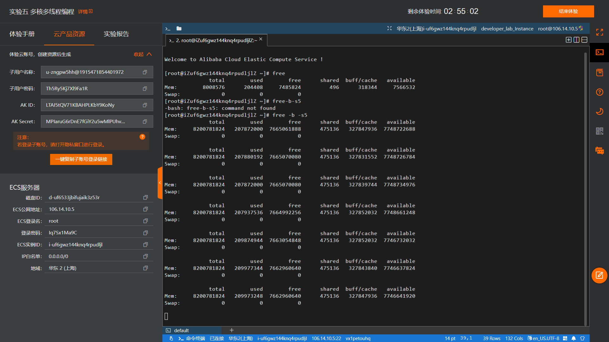
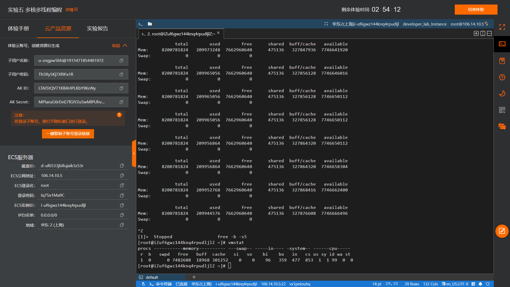
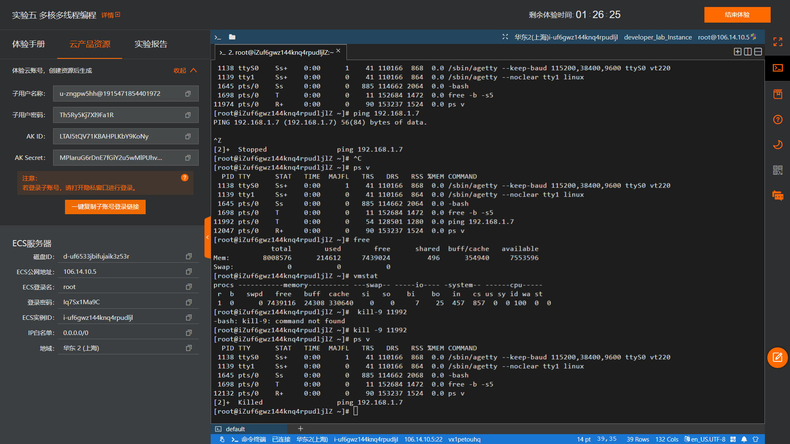

# **题目：内存管理——内存监控检查回收**

# 实验目的

掌握查看实时监控内存、内存回收的方法；  
进一步掌握虚拟存储器的实现方法并理解虚拟内存、磁盘缓存的概念；  
掌握基本的内存管理知识。

# 实验内容

1. 用free命令监控内存使用情况，用vmstat命令监视虚拟内存使用情况。
2. 用命令ps检查和回收内容，用kill命令回收泄漏的内存。

# 实验设计原理

* 在提示符后输入命令free：  
Mem行显示物理内存——  
total列显示共有的可用内存(不显示核心使用的物理内存,通常大约1MB)，  
used列显示被使用的内存总额，  
free列显示全部空闲的内存，  
shared列显示多个进程共享的内存总额，  
buffers列显示磁盘缓存的当前大小；  
Swap显示交换空间的信息，与上一行类似——如果该行为全0则没有使用交换空间。  
默认状态下,free命令以千字节(即1024字节为单位)显示内存使用情况。若使用-h参数，则以字节为单位显示内存使用情况;若使用-m参数，则以兆字节为单位显示内存使用情况。若命令带-s参数，则不间断地监视内存使用情况，如#free -b -s5,则表示该命令在终端窗口中连续不断地报告内存的使用情况，每5s更新一次。

* vmstat命令是一个通用监控程序，是VirtualMemoryStatistics(虚拟内存统计)的缩写。若vmstat命令没有带任何命令行参数，将得到一次性的报告。vmstat命令报告主要的活动类型有进程(procs)、内存(以千字节为单位)、交换分区(以千字节为单位)、来自块设备(硬盘驱动器)的输入输出量、系统中断(每秒发生的次数)，以及中央处理单元(CPU)分配给用户、系统和空闲时分别占用的比例。

* 可以用ps、kill两个命令检测内存使用情况和进行回收。使用超级用户权限时，用命令ps可列出所有正在运行的程序名称和对应的进程号(PID)。kill 命令的工作原理是向Linux操作系统的内核送出一个系统操作信号和程序的进程号(PID)。

# 实验步骤
1.用free命令监控内存使用情况
```
# free
# free -b -s5
```
用vmstat命令监视虚拟内存使用情况。
```
# vmstat
```

2.检查和回收内容
用命令ps列出所有正在运行的程序名称、对应的进程号(PID)等信息。
```
#ps v
```
手动执行一次不回收的Ping指令，造成内存泄漏的现象。
再次使用ps查看Ping指令对应的PID，用kill命令回收泄漏的内存。
```
# kill -9 <PID>
```

# 实验结果及分析



内存管理程序通过映射机制把用户程序的逻辑地址映射到物理地址。当用户程序运行时，如果发现程序需要的虚拟地址没有对应的物理内存，即发出请求页要求。如果有空闲的内存可供分配，就请求分配内存(用到内存分配和回收机制)，并把正在使用的物理页记录在缓存中（用到缓存机制）。如果没有足够的内存可供分配,则调用交换机制，腾出一部分内存。另外，在地址映射中要通过TLB( Translation Lookaside Buffer, 页表缓冲)寻找物理页；交换机制中用到交换缓存，并且把物理页内容交换到交换文件中，也要修改页表来映射文件地址。

# 程序代码

```
# free
# free -b -s5
# vmstat
# ps v
# ping 192.168.1.7
# kill -9 <PID>
```