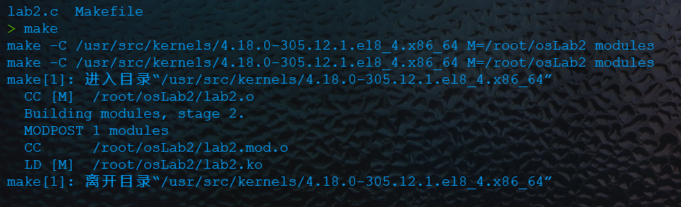
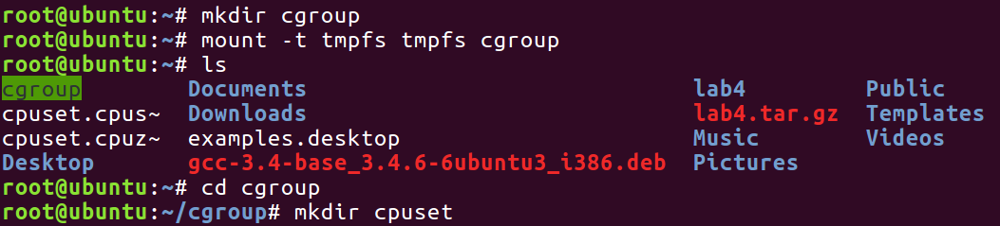
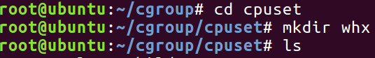
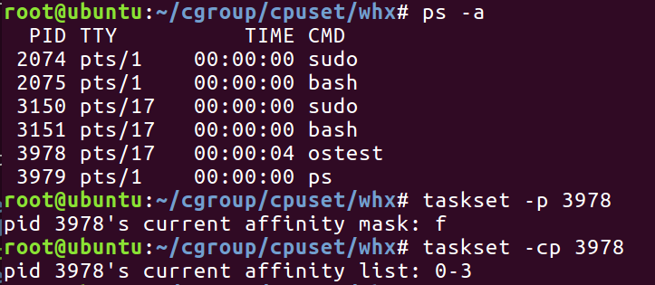

# 实验五

[toc]

## 题目5-1 内核模块编程：打印当前CPU负载

## 实验目的

1. 了解linux 的proc文件系统功能。
2. 掌握内核模块编程的基本能力。
3. 掌握在内核中读写文件数据的方法（数据结构和函数接口等）。

## 实验内容

​	使用内核模块编程的方法从系统中获取1min内当前cpu的负载，并将其打印出来。

## 实验设计原理和步骤

### 原理方法

​	路径 /proc/下的系统文件loadavg中存有近期的cpu平均负载。

​	如图，前面三个数字分别是cpu在1分钟、5分钟、15分钟内的平均负载。

​	因此在代码中读取该文件内容从而获取平均负载即可。


### 代码步骤

​	代码的核心部分包括：

1. 将文件/proc/loadavg打开（get_loadavg函数完成）；

2. 读取文件最开头的数据，即1min内平均负载（get_loadavg函数完成）；

3. 将数据保存后关闭文件（get_loadavg函数完成）；

4. 通过printk函数打印（cpu_loadavg_init函数完成）；

   然后cpu_loadavg_init函数作为模块的init函数，在模块被加载时调用。

   详细代码见后文程序代码部分。

## 实验结果及分析

编译完成



从加载模块到卸载模块


单看dmesg输出


## 程序代码

#### 模块源文件

 [lab2.c](src1\lab2.c) 

```c
#include <linux/module.h>
#include <linux/fs.h>

MODULE_LICENSE("GPL");

char tmp_cpu_load[5] = {'\0'};

static int get_loadavg(void)
{
	struct file *fp_cpu;
	loff_t pos = 0;
	char buf_cpu[10];
	fp_cpu = filp_open("/proc/loadavg", O_RDONLY, 0);
	if (IS_ERR(fp_cpu)){
		printk("Failed to open loadavg file!\n");
		return -1;
	}
	kernel_read(fp_cpu, buf_cpu, sizeof(buf_cpu), &pos);
	strncpy(tmp_cpu_load, buf_cpu, 4);
	filp_close(fp_cpu, NULL);
	return 0;
}

static int __init cpu_loadavg_init(void)
{
	printk("Start cpu_loadavg!\n");
	if(0 != get_loadavg()){
		printk("Failed to read loadarvg file!\n");
		return -1;
	}
	printk("The cpu loadavg in one minute is: %s\n", tmp_cpu_load);
	return 0;
}

static void __exit cpu_loadavg_exit(void)
{
	printk("Exit cpu_loadavg!\n");
}

module_init(cpu_loadavg_init);
module_exit(cpu_loadavg_exit);
```

#### Makefile文件

 [Makefile](src1\Makefile) 

```makefile
ifneq ($(KERNELRELEASE),)
	obj-m := lab2.o
else
	PWD := $(shell pwd)
	KVER ?=$(shell uname -r)
	KERNELDIR :=/usr/src/kernels/$(KVER)
default:
	@echo $(MAKE) -C $(KERNELDIR) M=$(PWD) modules
	$(MAKE) -C $(KERNELDIR) M=$(PWD) modules
endif
.PHONY:clean
clean:
	-rm *.mod.c *.o *.order *.symvers *.ko

```

## 题目5-2 使用cgroup限制程序使用的CPU核数

## 实验目的

1. 了解**cgroup** **虚拟文件系统**的功能。
2. 掌握使用**cgroup** **虚拟文件系统**进行管理的方法。

## 实验内容

​	创建临时文件系统格式（tmpfs）的cgroup虚拟文件系统，在其中挂载的cpuset管理子系统中限制CPU使用的核数。

​	然后编写程序并运行，对比普通运行核在指定cpuset管理子系统设置下运行时使用的CPU核数。

## 实验步骤

1. 使用mount命令创建tmpfs临时文件系统格式的cgroup虚拟文件系统并创建cpuset子系统文件夹。

   

2. 进入cpuset文件夹挂载自己的cpuset子系统。

   

   

3. 设置限制的cpu核数。

   **备注**：这里应当注意，echo 0 >cpuset.mems不能省略。

   ​		  这里的cpu核数限制为最多只能使用核0、1和2

   

4. 编写程序运行，并查看其运行在哪些核上。

   运行：

   

   查看：

   

5. 同样的程序运行在刚刚设置的cgroup上。

   运行：

   

   查看：

   

   

     **备注**：
   
   ​		需要注意的是，这里运行时不宜通过查看各cpu占有率的方式来判断死循环程序运行在哪些cpu核上，因为这个死循环程序并未设计为可以在多核上运行。

## 实验结果及分析

  		1. 查看本机内核：共有四个内核，说明不做限制时程序默认可以运行在所有核上。
  		2. 从上面的实验中我们通过taskset命令看到cgroup可以指定其运行在限定的内核上，例如这里的0、1、核2号内核。
  		3.  总结：实验证明，cgroup可以限制程序运行在哪些内核上。

## 程序代码

运行的程序（死循环）

 [ostest.c](src2\ostest.c) 

```c
#include <stdio.h>
#include <stdlib.h>

int main(int argc, char *argv[])
{
	int i=0;
	while (1){i++;}
	printf("Over");
	exit(0);
}

```


