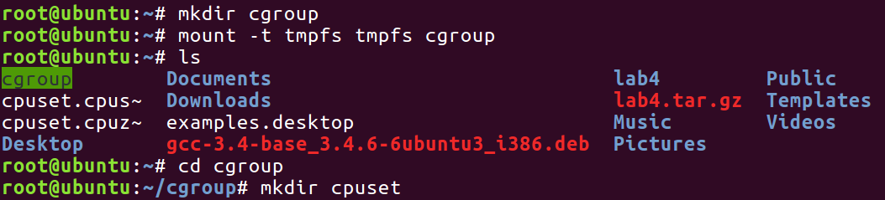
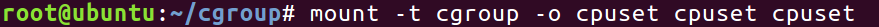
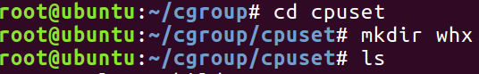
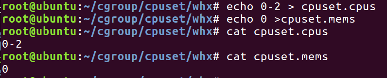
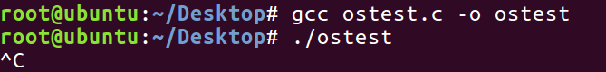
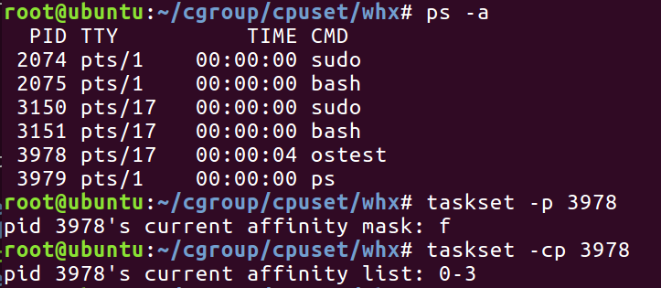
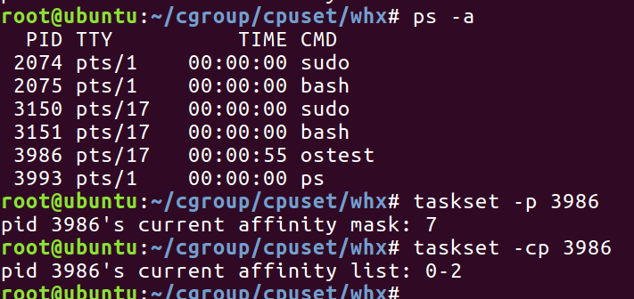

## 题目 使用cgroup限制程序使用的CPU核数

## 实验目的

1. 了解**cgroup** **虚拟文件系统**的功能。
2. 掌握使用**cgroup** **虚拟文件系统**进行管理的方法。

## 实验内容

​	创建临时文件系统格式（tmpfs）的cgroup虚拟文件系统，在其中挂载的cpuset管理子系统中限制CPU使用的核数。

​	然后编写程序并运行，对比普通运行核在指定cpuset管理子系统设置下运行时使用的CPU核数。

## 实验步骤

1. 使用mount命令创建tmpfs临时文件系统格式的cgroup虚拟文件系统并创建cpuset子系统文件夹。

   

2. 进入cpuset文件夹挂载自己的cpuset子系统（这里是whx）。

   

   

3. 设置限制的cpu核数。

   **备注**：这里应当注意，echo 0 >cpuset.mems不能省略。

   ​		  这里的cpu核数限制为最多只能使用核0、1和2

   

4. 编写程序运行，并查看其运行在哪些核上。

   运行：

   

   查看：

   

5. 同样的程序运行在刚刚设置的cgroup上。

   运行：

   

   查看：

   

   

     **备注**：
   
   ​		需要注意的是，这里运行时不宜通过查看各cpu占有率的方式来判断死循环程序运行在哪些cpu核上，因为这个死循环程序并未设计为可以在多核上运行。

## 实验结果及分析

  		1. 查看本机内核：共有四个内核，说明不做限制时程序默认可以运行在所有核上。
  		2. 从上面的实验中我们通过taskset命令看到cgroup可以指定其运行在限定的内核上，例如这里的0、1、核2号内核。
  		3.  总结：实验证明，cgroup可以限制程序运行在哪些内核上。

## 程序代码

运行的程序（死循环）

 [ostest.c](src2\ostest.c) 

```c
#include <stdio.h>
#include <stdlib.h>

int main(int argc, char *argv[])
{
	int i=0;
	while (1){i++;}
	printf("Over");
	exit(0);
}

```


