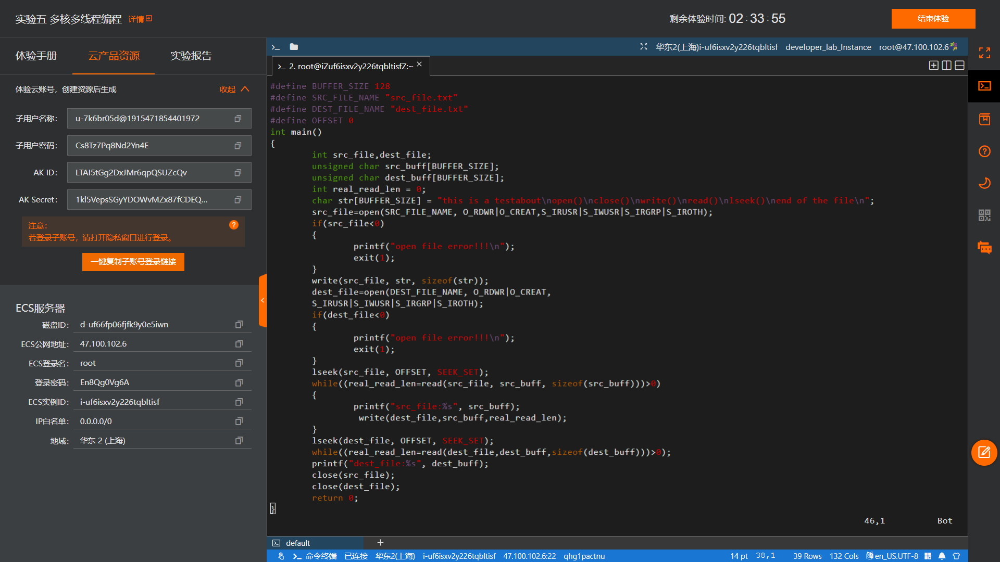
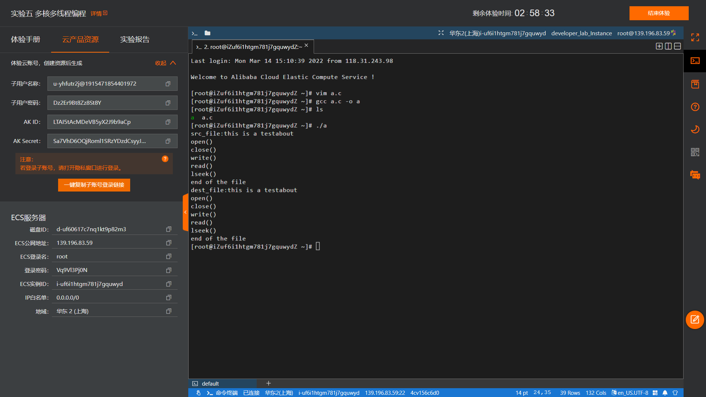

# **题目：文件系统——文件访问**

# 实验目的

学习使用文件访问系统调用函数，了解各调用具体功能和底层原理。

# 实验内容

利用create、open、close、read、write等文件访问系统调用创建文件，并源文件中内容拷贝至目标文件。

# 实验设计原理

## open（）函数
*功能描述*：用于打开或创建文件，在打开或创建文件时可以指定文件的属性及用户的权限等各种参数。  
*所需头文件*:
```cpp
#include <sys/types.h>
#include <sys/stat.h>
#include <fcntl.h>
```
*函数原型*:  
```cpp
int open(const char *pathname,int flags,int perms)
```
*参数*：  
`pathname`:被打开的文件名（可包括路径名如"dev/ttyS0"）  
`flags`:文件打开方式,  
`O_RDONLY`:以只读方式打开文件  
`O_WRONLY`:以只写方式打开文件  
`O_RDWR`:以读写方式打开文件  
`O_CREAT`:如果改文件不存在，就创建一个新的文件，并用第三个参数为其设置权限  
`O_EXCL`:如果使用O_CREAT时文件存在，则返回错误消息。这一参数可测试文件是否存在。此时open是原子操作，防止多个进程同时创建同一个文件  
`O_NOCTTY`:使用本参数时，若文件为终端，那么该终端不会成为调用open()的那个进程的控制终端  
`O_TRUNC`:若文件已经存在，那么会删除文件中的全部原有数据，并且设置文件大小为0  
`O_APPEND`:以添加方式打开文件，在打开文件的同时，文件指针指向文件的末尾，即将写入的数据添加到文件的末尾  
`O_NONBLOCK`: 如果pathname指的是一个FIFO、一个块特殊文件或一个字符特殊文件，则此选择项为此文件的本次打开操作和后续的I/O操作设置非阻塞方式。  
`O_SYNC`:使每次write都等到物理I/O操作完成。  
`O_RSYNC`:read 等待所有写入同一区域的写操作完成后再进行  
在open()函数中，falgs参数可以通过“|”组合构成，但前3个标准常量（O_RDONLY，O_WRONLY，和O_RDWR）不能互相组合。  
`perms`:被打开文件的存取权限，可以用两种方法表示，可以用一组宏定义：S_I(R/W/X)(USR/GRP/OTH),其中R/W/X表示读写执行权限，
USR/GRP/OTH分别表示文件的所有者/文件所属组/其他用户,如S_IRUUR|S_IWUUR|S_IXUUR,（-rex------）,也可用八进制800表示同样的权限  
*返回值*：  
成功：返回文件描述符  
失败：返回-1

## close()函数
功能描述：用于关闭一个被打开的的文件  
*所需头文件*：
```cpp
#include <unistd.h>
```
*函数原型*:
```cpp
int close(int fd)
```
*参数*：fd文件描述符  
*函数返回值*：0成功，-1出错 

## read()函数
*功能描述*： 从文件读取数据。  
*所需头文件*：
```cpp
#include <unistd.h>
```
*函数原型*：
```cpp
ssize_t read(int fd, void *buf, size_t count);
```
*参数*：  
`fd`： 将要读取数据的文件描述词。  
`buf`：指缓冲区，即读取的数据会被放到这个缓冲区中去。  
`count`： 表示调用一次**read**操作，应该读多少数量的字符。  
*返回值*：返回所读取的字节数；  
0（读到EOF）；-1（出错）。  
以下几种情况会导致读取到的字节数小于 `count`：

    1. 读取普通文件时，读到文件末尾还不够 count 字节。  
    例如：如果文件只有 30 字节，而我们想读取 100字节，那么实际读到的只有 30 字节，read 函数返回 30 。此时再使用 read 函数作用于这个文件会导致 read 返回 0 。
    2. 从终端设备（terminal device）读取时，一般情况下每次只能读取一行。
    3. 从网络读取时，网络缓存可能导致读取的字节数小于 count字节。
    4. 读取 pipe 或者 FIFO 时，pipe 或 FIFO 里的字节数可能小于 count 。
    5. 从面向记录（record-oriented）的设备读取时，某些面向记录的设备（如磁带）每次最多只能返回一个记录。
    6. 在读取了部分数据时被信号中断。

读操作始于 cfo 。在成功返回之前，cfo 增加，增量为实际读取到的字节数。

## write()函数
*功能描述*： 向文件写入数据。  
*所需头文件*： 
```cpp
#include <unistd.h>
```
*函数原型*：
```cpp
ssize_t write(int fd, void *buf, size_t count);
```
*返回值*：  
写入文件的字节数（成功）；-1（出错）  
*功能*：write 函数向 filedes 中写入 count 字节数据，数据来源为 buf 。返回值一般总是等于 count，否则就是出错了。常见的出错原因是磁盘空间满了或者超过了文件大小限制。  
对于普通文件，写操作始于 cfo 。如果打开文件时使用了 O_APPEND，则每次写操作都将数据写入文件末尾。成功写入后，cfo 增加，增量为实际写入的字节数。

## lseek()函数 
*功能描述*： 用于在指定的文件描述符中将将文件指针定位到相应位置。  
*所需头文件*： 
```cpp
#include <unistd.h>，#include <sys/types.h>
```
*函数原型*：
```cpp
off_t lseek(int fd, off_t offset,int whence);
```
*参数*：  
`fd`:文件描述符  
`offset`:偏移量，每一个读写操作所需要移动的距离，单位是字节，可正可负（向前移，向后移）  
`whence`:  
* SEEK_SET:当前位置为文件的开头，新位置为偏移量的大小
* SEEK_CUR:当前位置为指针的位置，新位置为当前位置加上偏移量
* SEEK_END:当前位置为文件的结尾，新位置为文件大小加上偏移量的大小

*返回值*：  
成功：返回当前位移  
失败：返回-1

# 实验步骤

使用open函数创建源文件后用write函数写数据。使用open函数创建目标文件后调用lseek函数将源文件的读写指针移到起始点，接上read读取源文件内容的while循环。最终调用close关闭源文件和目标文件流。

# 实验结果及分析



源文件及目标文件在所有操作后内容相同。

# 程序代码

```cpp
#include <stdio.h>
#include <string.h>
#include <stdlib.h>
#include <unistd.h>
#include <fcntl.h>
#include<sys/types.h>
#include<sys/stat.h>
#include <errno.h>
#define BUFFER_SIZE 128
#define SRC_FILE_NAME "src_file.txt"
#define DEST_FILE_NAME "dest_file.txt"
#define OFFSET 0
int main()
{
	int src_file,dest_file;
	unsigned char src_buff[BUFFER_SIZE];
	unsigned char dest_buff[BUFFER_SIZE];
	int real_read_len = 0;
	char str[BUFFER_SIZE] = "this is a testabout\nopen()\nclose()\nwrite()\nread()\nlseek()\nend of the file\n";
	src_file=open(SRC_FILE_NAME, O_RDWR|O_CREAT,S_IRUSR|S_IWUSR|S_IRGRP|S_IROTH);
	if(src_file<0)
	{
		printf("open file error!!!\n");
		exit(1);
	}
	write(src_file, str, sizeof(str));
	dest_file=open(DEST_FILE_NAME, O_RDWR|O_CREAT,S_IRUSR|S_IWUSR|S_IRGRP|S_IROTH); 
	if(dest_file<0)
	{
		printf("open file error!!!\n");
		exit(1);
	}
	lseek(src_file, OFFSET, SEEK_SET); 
	while((real_read_len=read(src_file, src_buff, sizeof(src_buff)))>0)
	{
		printf("src_file:%s", src_buff);
 		write(dest_file,src_buff,real_read_len);
	}
	lseek(dest_file, OFFSET, SEEK_SET); 
	while((real_read_len=read(dest_file,dest_buff,sizeof(dest_buff)))>0); 
	printf("dest_file:%s", dest_buff);
	close(src_file);
	close(dest_file);
	return 0;
}
```