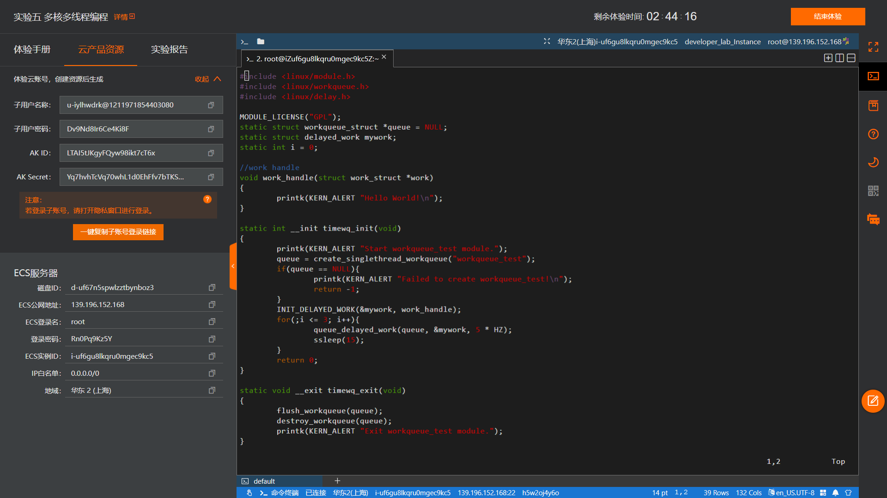
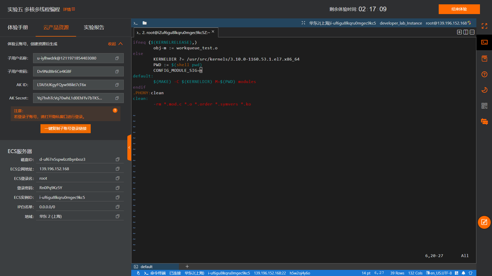
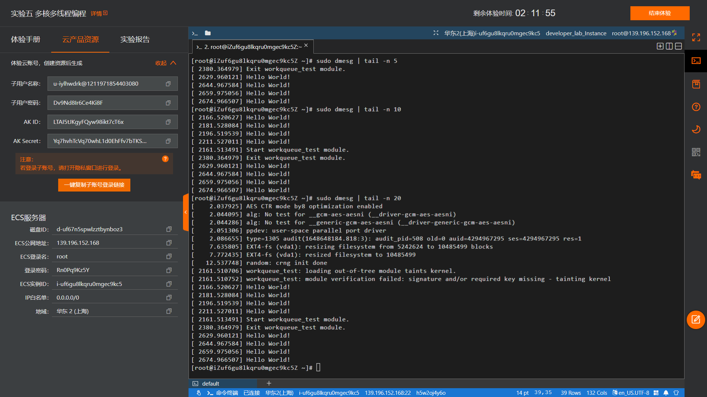
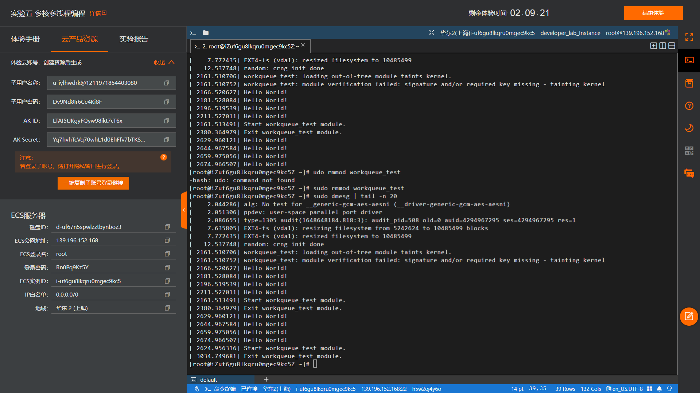

# **题目：中断和异常管理——用工作队列实现周期打印helloworld**

# 实验目的

学习使用Linux内核提供的工作队列的创建、调度使用及释放。

# 实验内容

1. 编写一个内核模块程序，用工作队列实现周期打印helloworld。
2. 加载、卸载模块并查看模块打印信息。

# 实验设计原理

## 一、内核工作队列的运行机制

工作队列是从Linux 内核2.5版本开始提供的实现延迟的新机制。
工作队列（workqueue）是另外一种将工作延迟执行的形式。工作队列可以把工作延迟，交由一个内核线程去执行，也就是说，这个下半部分可以在进程上下文中执行。这样，通过工作队列执行的代码能占尽进程上下文的所有优势，且工作队列实现了内核线程的封装，不易出错。最重要的就是工作队列允许被重新调度甚至是睡眠，允许内核代码来请求在将来某个时间调用一个函数，用来处理不是很紧急事件的回调方式处理方法。

## 二、工作队列的数据结构与编程接口API

1. 表示工作的数据结构（定义在内核源码：include/linux/workqueue.h）
    1. 正常的工作用 <linux/workqueue.h> 中定义的work_struct结构表示：
    ```c
    struct work_ struct {
    	atomic_ Long_ t data;
    	struct tist head entry;
    	work_ func_ t func ;
    #ifdef CONFIG L OCKDEP
    	struct Lockdep map Lockdep map;
    #endif
    	KABI RESERVE(1)
    	KABI RESERVE(2)
    	KABI RESERVE (3 )
    	KABI RESERVE( 4)
    };
    ```
        这些结构被连接成链表。当一个工作者线程被唤醒时，它会执行它的链表上的所有工作。工作被执行完毕，它就将相应的work_struct对象从链表上移去。当链表上不再有对象的时候，它就会继续休眠。
    
    2. 延迟的工作用delayed_work数据结构，可直接使用delay_work将任务推迟执行。
    ```c
    struct delayed work {
        struct work_ struct work; 
        struct timer List timer :
        /* target workqueue and CPU >timer uses to queue >work */
        struct workqueue_ struct *wq;
        int cpu;
        /* delayed work private data, only used in pc iehp now */
        unsigned long data ;
        KABI RESERVE( 1)
        KABI RESERVE(2)
        KABI RESERVE(3)
        KABI RESERVE(4 )
    };
    ```
2. 工作队列中待执行的函数（定义在内核源码：include/linux/workqueue.h）

    work_struct结构中包含工作队列待执行的函数定义 work_func_t func；
该工作队列待执行的函数原型是： typedef void (*work_func_t)(struct work_struct *work)
这个函数会由一个工作者线程执行，因此，函数会运行在进程上下文中。默认情况下，允许响应中断，并且不持有任何锁。如果需要，函数可以睡眠。需要注意的是，尽管该函数运行在进程上下文中，但它不能访问用户空间，因为内核线程在用户空间没有相关的内存映射。通常在系统调用发生时，内核会代表用户空间的进程运行，此时它才能访问用户空间，也只有在此时它才会映射用户空间的内存。
例如：
```c
void work_handle(struct work_struct *work)
{
        printk(KERN_ALERT "Hello World!/n");
}
```

## 三、工作队列的使用

1. 工作队列的创建
要使用工作队列，需要先创建工作项，有以下两种方式：
    
    1. 静态创建
    
        DECLARE_WORK(n, f);              定义正常执行的工作项
DECLARE_DELAYED_WORK(n, f);     定义延后执行的工作项
其中，n表示工作项的名字，f表示工作项执行的函数。
这样就会静态地创建一个名为n，待执行函数为f的work_struct结构。
    2. 动态创建、运行时创建：
通常在内核模块函数中执行以下函数：
INIT_WORK(_work, _func);            初始化正常执行的工作项
INIT_DELAYED_WORK(_work, _func);   初始化延后执行的工作项

        其中，_work表示work_struct的任务对象；_func表示工作项执行的函数。
这会动态地初始化一个由work指向的工作。
2. 工作项与工作队列的调度运行
    1. 工作项的调度运行
    
        工作成功创建后，我们可以调度它了。想要把给定工作的待处理函数提交给缺省的events工作线程，只需调用schedule_work(&work)；work马上就会被调度，一旦其所在的处理器上的工作者线程被唤醒，它就会被执行。有时候并不希望工作马上就被执行，而是希望它经过一段延迟以后再执行。在这种情况下，可以调度它在指定的时间执行：
schedule_delayed_work(&work,delay);
这时，&work指向的work_struct直到delay指定的时钟节拍用完以后才会执行。
    2. 工作队列的调度运行
  对于工作队列的调度，则使用以下两个函数：
	bool queue_work(struct workqueue_struct *wq, struct work_struct *work)	
调度执行一个指定workqueue中的任务。

        示例：queue_work(queue, &work)
	bool queue_delayed_work(struct workqueue_struct *wq, struct delayed_work *dwork, unsigned long delay)延迟调度执行一个指定workqueue中的任务，功能与queue_work类似，输入参数多了一个delay。


        示例：queue_ delayed_work(queue, &work, 0)

3、工作队列的释放

void flush_workqueue(struct workqueue_struct *wq);   //刷新工作队列，等待指定列队中的任务全部执行完毕。

void destroy_workqueue(struct workqueue_struct *wq);   //释放工作队列所占的资源


# 实验步骤

编写C程序代码。首先调用模块初始化函数创建一个名为workqueue_test工作队列，并将“Hello World”的输出工作加载进入队列中。之后4次循环使输出工作以5Hz的延迟进行，并在每次工作后加入15Hz的睡眠时间。最后调用出口函数将工作队列释放。
编写Makefile代码。在基本格式中额外加入CONFIG_MODULE_SIG=n参数来确保加载模块的时候不检查签名，以免在检测未通过后加载失败。

# 实验结果及分析



实验完成后一共加载两次模块，前一次由于签名未通过在Makefile文件中加入了上述步骤的关闭签名检测的代码。

通过实验最终输出，可以确认模块在载入的5秒后开始执行输出工作，并在之后每隔15秒输出一次，最终输出4行Hello World文本，与代码显示工作队列的执行流程相符。

# 程序代码

## workqueue_test.c
```c
#include <linux/module.h>
#include <linux/workqueue.h>
#include <linux/delay.h>

MODULE_LICENSE("GPL");
static struct workqueue_struct *queue = NULL;
static struct delayed_work mywork;
static int i = 0;

//work handle
void work_handle(struct work_struct *work)
{
    printk(KERN_ALERT "Hello World!\n");
}

static int __init timewq_init(void)
{
    printk(KERN_ALERT "Start workqueue_test module.");
    queue = create_singlethread_workqueue("workqueue_test");
    if(queue == NULL){
        printk(KERN_ALERT "Failed to create workqueue_test!\n");
        return -1;
    }
    INIT_DELAYED_WORK(&mywork, work_handle);
    for(;i <= 3; i++){
        queue_delayed_work(queue, &mywork, 5 * HZ);
        ssleep(15);
    }
    return 0;
}

static void __exit timewq_exit(void)
{
    flush_workqueue(queue);
    destroy_workqueue(queue);
    printk(KERN_ALERT "Exit workqueue_test module.");
}

module_init(timewq_init);
module_exit(timewq_exit);
```
## Makefile
```c
ifneq ($(KERNELRELEASE),)
    obj-m := workqueue_test.o
else
    KERNELDIR ?= /usr/src/kernels/3.10.0-1160.53.1.el7.x86_64
PWD := $(shell pwd)
	CONFIG_MODULE_SIG=n
default:
    $(MAKE) -C $(KERNELDIR) M=$(PWD) modules
endif
.PHONY:clean
clean:
    -rm *.mod.c *.o *.order *.symvers *.ko
```