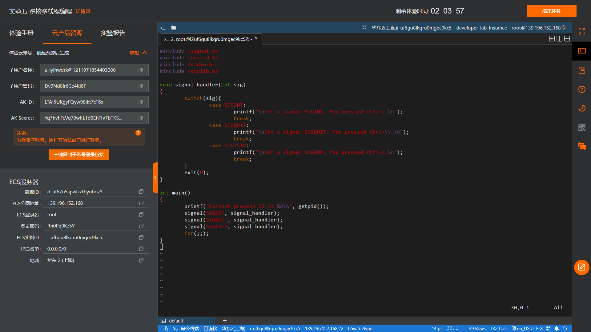
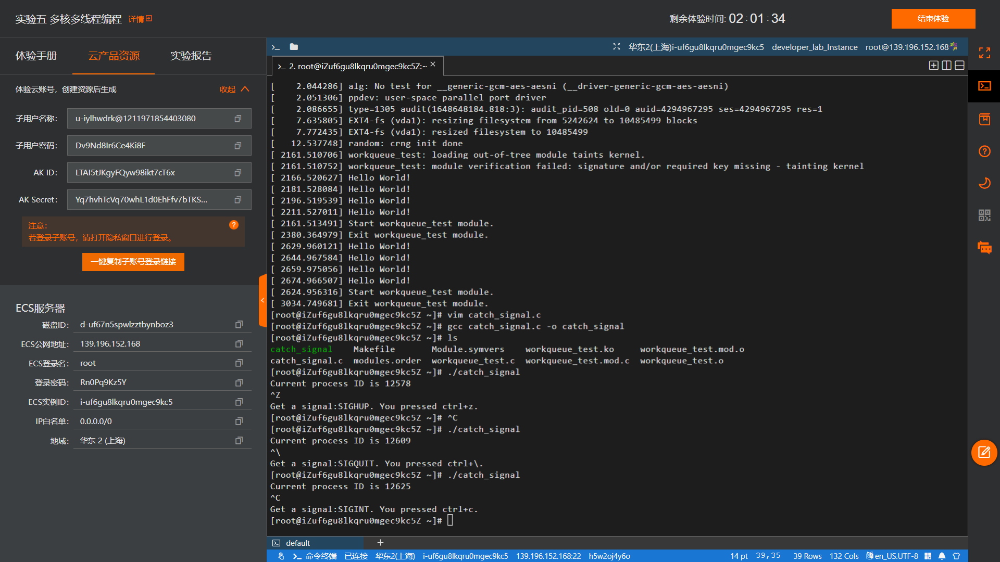

# **题目：中断和异常管理——捕获终端按键信号**

# 实验目的

1. 了解Linux的信号处理机制；
2. 学习使用Linux内置信号处理函数。

# 实验内容

1. 在用户态编写一个信号捕获程序，捕获终端按键信号（包括ctrl+c、ctrl+z、ctrl+\）。
2. 编译上述程序后运行，在终端输入按键信号（ctrl+c、ctrl+z、ctrl+\），查看输出信息。

# 实验设计原理

## 一、Linux信号处理机制 
1. 基本概念

    Linux提供的信号机制是一种进程间异步的通信机制，每个进程在运行时，都要通过信号机制来检查是否有信号到达，若有，便中断正在执行的程序，转向与该信号相对应的处理程序，以完成对该事件的处理；处理结束后再返回到原来的断点继续执行。实质上，信号机制是对中断机制的一种模拟，在实现上是一种软中断。
2. 信号的产生

    信号的生成来自内核，让内核生成信号的请求来自3个地方：

    * 用户：用户能够通过终端按键产生信号，例如；
    
	    ctrl+c ---->  2) SIGINT(终止、中断）

	    ctrl+\ ---->  3) SIGQUIT(退出）

	    ctrl+z ---->  20) SIGTSTP（暂时、停止）
	
        或者是终端驱动程序分配给信号控制字符的其他任何键来请求内核产生信号
    * 内核：当进程执行出错时，内核会给进程发送一个信号，例如非法段存取(内存访问违规)、浮点数溢出等；
    * 进程：一个进程可以通过系统调用kill给另一个进程发送信号，一个进程可以通过信号和另外一个进程进行通信。
当信号发送到某个进程中时，操作系统会中断该进程的正常流程，并进入相应的信号处理函数执行操作，完成后再回到中断的地方继续执行。需要说明的是，信号只是用于通知进程发生了某个事件，除了信号本身的信息之外，并不具备传递用户数据的功能。
3. 信号的响应动作/处理
每个信号都有自己的响应动作，当接收到信号时，进程会根据信号的响应动作执行相应的操作，信号的响应动作有以下几种：
    1)	中止进程(Term)
    2)	忽略信号(Ign)
    3)	中止进程并保存内存信息(Core)
    4)	停止进程(Stop)
    5)	继续运行进程(Cont)

    用户可以通过signal或sigaction函数修改信号的响应动作（也就是常说的“注册信号”）。另外，在多线程中，各线程的信号响应动作都是相同的，不能对某个线程设置独立的响应动作。
4. 信号类型
Linux支持的信号类型可以参考kill -l显示的编号列表，其中1-31为常规信号，34-64为实时信号。
```bash
1) SIGHUP	 2) SIGINT	 3) SIGQUIT	 4) SIGILL	 5) SIGTRAP
 6) SIGABRT	 7) SIGBUS	 8) SIGFPE	 9) SIGKILL	10) SIGUSR1
11) SIGSEGV	12) SIGUSR2	13) SIGPIPE	14) SIGALRM	15) SIGTERM
16) SIGSTKFLT	17) SIGCHLD	18) SIGCONT	19) SIGSTOP	20) SIGTSTP
21) SIGTTIN	22) SIGTTOU	23) SIGURG	24) SIGXCPU	25) SIGXFSZ
26) SIGVTALRM	27) SIGPROF	28) SIGWINCH	29) SIGIO	30) SIGPWR
31) SIGSYS	34) SIGRTMIN	35) SIGRTMIN+1	36) SIGRTMIN+2	37) SIGRTMIN+3
38) SIGRTMIN+4	39) SIGRTMIN+5	40) SIGRTMIN+6	41) SIGRTMIN+7	42) SIGRTMIN+8
43) SIGRTMIN+9	44) SIGRTMIN+10	45) SIGRTMIN+11	46) SIGRTMIN+12	47) SIGRTMIN+13
48) SIGRTMIN+14	49) SIGRTMIN+15	50) SIGRTMAX-14	51) SIGRTMAX-13	52) SIGRTMAX-12
53) SIGRTMAX-11	54) SIGRTMAX-10	55) SIGRTMAX-9	56) SIGRTMAX-8	57) SIGRTMAX-7
58) SIGRTMAX-6	59) SIGRTMAX-5	60) SIGRTMAX-4	61) SIGRTMAX-3	62) SIGRTMAX-2
63) SIGRTMAX-1	64) SIGRTMAX	
```
## 二、信号处理函数signal()
函数原型：void (*signal (int signum ,void (*handler)(int))) (int) ;

功能：设置捕捉某一信号后，对应的处理函数。

头文件：#include <signal.h>

参数说明：
signum：指定的信号的编号（或捕捉的信号），可以使用头文件中规定的宏；
handle：函数指针，是信号到来时需要运行的处理函数，参数是signal()的第一个参数signum。
对于第二个参数，可以设置为SIG_IG，表示忽略第一个参数的信；可以设置为SIG_DFL，表示采用默认的方式处理信号；也可以指定一个函数地址，自己实现处理方式。
返回值：
运行成功，返回原信号处理函数的指针；失败则返回SIG_ERR。

说明：
    signal()用于注册一个信号捕捉函数，而捕捉信号的操作由内核进行。
捕获信号示例：
```c
void sighandle(int sig)
{
     printf("捕获到信号%d", sig);
     exit(0);        // 释放资源
} 
 
int main()
{
    .....
    signal(SIGINT, sighandle);  //设置信号处理函数
    .....
}
```
## 三、信号与中断的异同点
1. 信号与中断的相似点

    （1）采用了相同的异步通信方式；

    （2）当检测出有信号或中断请求是，都暂停正在执行的程序，转而去执行相应的处理程序；

    （3）都在处理完毕后返回到原来的断点；

    （4）对信号或中断都可进行评比。
2. 信号与中断的区别
    
    （1）中断有优先级，而信号没有优先级，所有信号都是平等的；
    
    （2）信号处理程序是在用户态下运行的；而中断处理程序是在内核态下运行的；
    
    （3）中断响应是及时的，而信号响应通常有较大的时间延迟。

# 实验步骤

编写C程序。利用switch根据Linux从键盘读入的不同指令输出不同文本，并将当前进程的PID打印出来。

# 实验结果及分析


当获取到用户输入ctrl+c，输出文本得到了“中断信号”；

当获取到用户输入ctrl+\，输出文本得到了“退出信号”；

当获取到用户输入ctrl+z，输出文本得到了“停止信号”。

需要额外注意的是：虽然实验文档供给的代码将ctrl+z标注为SIGHUP，但这是终端断连信号，与其本意SIGSTP有巨大的差异，后者才是正确的信号。


# 程序代码
## catch_signal.c
```c
#include <signal.h>
#include <unistd.h>
#include <stdio.h>
#include <stdlib.h>

void signal_handler(int sig)
{
    switch(sig){
        case SIGINT:
            printf("\nGet a signal:SIGINT. You pressed ctrl+c.\n");
            break;
        case SIGQUIT:
            printf("\nGet a signal:SIGQUIT. You pressed ctrl+\\.\n");
            break;
        case SIGTSTP:
            printf("\nGet a signal:SIGSTP. You pressed ctrl+z.\n");
            break;
    }
    exit(0);
}

int main()
{
    printf("Current process ID is %d\n", getpid());
    signal(SIGINT, signal_handler);
    signal(SIGQUIT, signal_handler);
    signal(SIGTSTP, signal_handler);
    for(;;);
}
```