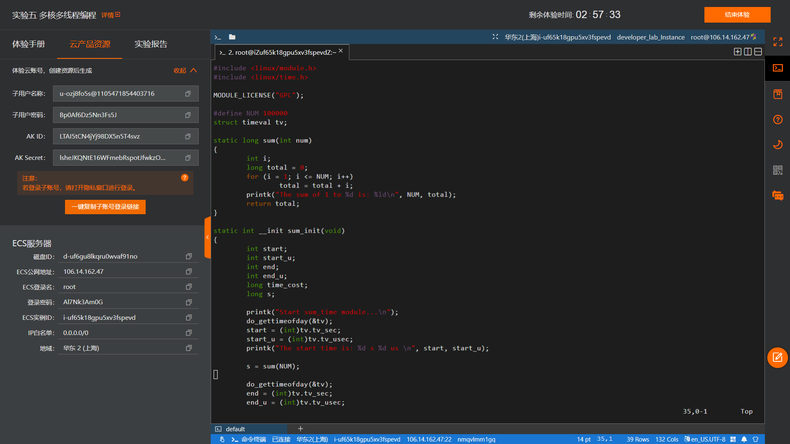
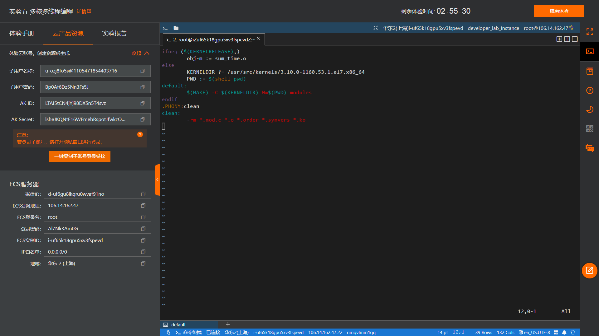
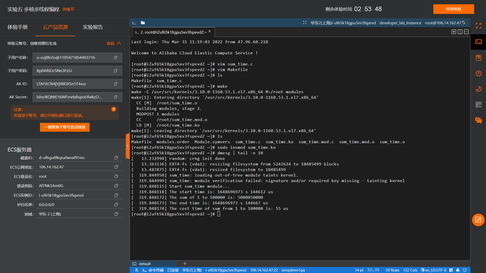
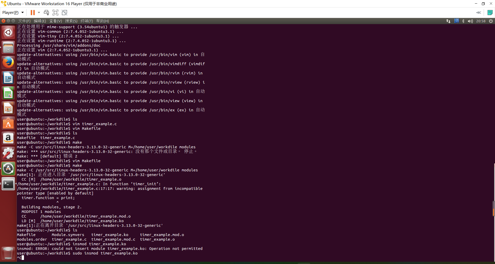
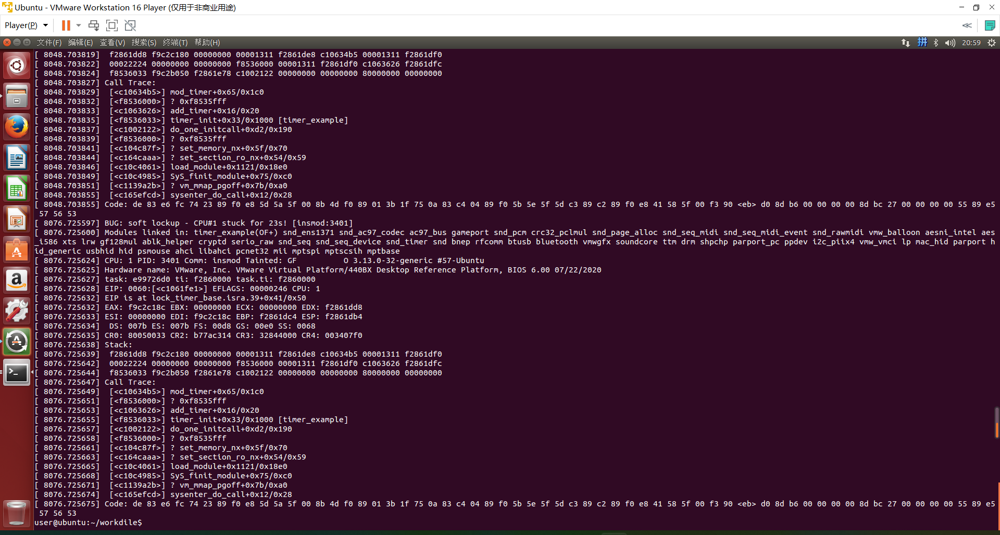

# **题目：内核时间管理——调用内核时钟接口监控运行时间**

# 实验目的

学习使用Linux内核时钟接口的调用。

# 实验内容

1. 调用内核时钟接口，编写内核模块，监控实现累加计算sum=1+2+3+...+100000 所花时间。
2. 加载、卸载模块并查看模块打印信息。

# 实验设计原理

1. timeval结构体 

    头文件：<linux/time.h>
```c
struct timeval { 
         __kernel_time_t         tv_sec;        /* seconds */ 
         __kernel_suseconds_t    tv_usec;        /* microseconds */ 
 };
```
其中tv_sec是自1970年1月1日 00:00:00 起到现在的秒数。而tv_usec是当前秒数已经经过的微秒数。

2. do_gettimeofday()

    头文件：<linux/time.h>
    
    函数原型：void do_gettimeofday(struct timeval *tv);
    
    功能：返回自1970-01-01  00:00:00到现在的秒数，及当前秒经过的毫秒数，保存在tv指向的timeval 结构体中。

3. rtc_time结构体

    头文件<linux/rtc.h>
```c
struct rtc_time {
     int tm_sec;           // 表「秒」数，在[0,61]之间，多出来的两秒是用来处理跳秒问题用的。
     int tm_min;          // 表「分」数，在[0,59]之间。
     int tm_hour;         // 表「时」数，在[0,23]之间。
     int tm_mday;        // 表「本月第几日」，在[1,31]之间。
     int tm_mon;         // 表「本年第几月」，在[0,11]之间。
     int tm_year;         // 要加1900表示那一年。
     int tm_wday;        // 表「本周第几日」，在[0,6]之间。
     int tm_yday;        // 表「本年第几日」，在[0,365]之间，闰年有366日。
     int tm_isdst;        // 表是否为「日光节约时间」。
 };
```
年份加上1900，月份加上1，小时加上8。

4. rtc_time_to_tm()

    头文件：<linux/rtc.h>
    
    函数原型：void rtc_time_to_tm(unsigned long time, struct rtc_time *tm)；

    功能：将time存储的秒数转换为年月日时分秒等信息保存在rtc_time结构体中。
    
    参数：time为秒数，可以是do_gettimeofday()函数获取的秒数。tm是rtc_time结构体指针，结构体中存放了年月日时分秒等信息。

# 实验步骤

编写C程序，程序主体以及测试对象为一个从1到100000的累加for循环。在调用累加函数之前使用模块初始化函数包装它：首先使用gettimeofday以及timeval获取当前系统时间并存储其秒级及微秒级部分，作为开始时间打印到屏幕上；随后执行累加函数；最后再次调用gettimeofday、timeval存储终止时间并打印，最终得到与开始时间的差打印到屏幕上即为总运行时间。最后退出并释放该模块。

# 实验结果及分析

## 实验结果




最终结果为累加求和总运行时间为55μs。

## 另关于实验6-5-2的分析

在选择内核时间管理部分的实验内容时，初选择的题目为6-5-2编写timer定时器。但因为笔者最终发现在Linux内核3.x版本中的定时器timer数据结构存在一些无法轻易调优的缺陷，而且内核产生了无法定位问题原因的软死锁，故放弃了该实验的进行转而进行本文的6-5-3。

我们先假设系统的内核抢占已经被开启：
```bash
CONFIG_PREEMPT=y    //即在内核配置文件中修改内核抢占为开启
```

实验中的timer初始化回调函数是这样定义的：
```c
    static int __init timer_init(void)
    {
        printk("Start timer_example module...\n");
        timer.expires = jiffies + 10 * HZ;
        timer.function = print;
        add_timer(&timer);
        return 0;
    }
```
看着没有任何问题的代码，看起来和死锁丝毫没有关系。

当我们详细了解了Linux timer的执行原理后就会明白：

* 挂载在同一CPU上的所有过期timer是顺序遍历执行的。

* 一轮timer的顺序遍历执行是持有自旋锁的。

这意味着在执行一轮过期timer的过程中，watchdog实时线程将无法被调度处理死锁，这意味着：

* 同一CPU上的过期timer积累到一定量，其回调函数的延时之和大于20秒，将会产生soft lockup（软死锁）。

        soft lockup是指CPU被内核代码占据，以至于无法执行其它进程的死锁情况。检测soft lockup的原理是给每个CPU分配一个定时执行的内核线程[watchdog/x]，如果该线程在设定的期限内没有得到执行的话就意味着发生了soft lockup，[watchdog/x]是SCHED_FIFO实时进程，优先级为最高的99，拥有优先运行的特权。


**个人推测：实验中仅仅执行加载调度的print函数的timer，也有触发soft lockup的可能性。**

得到这个推测前，我们需要先着手于Linux timer的工作机制来理清思路。

可以把timer的执行过程抽象成下面的逻辑：
```c
    run_timers()
    {
      while (now > base.early_jiffies) {
        for_each_timer(timer, base.list) {
          detach_timer(timer)
          forward_early_jiffies(base)
          call_timer_fn(timer)
        }
      }
    }
```
内核把当前过期的timer轮流执行到结束，而在系统开启内核抢占时，我们假设run_timers是在时钟中断退出时的软中断上下文中执行的，此时它不能被watchdog抢占。

视角回到前文timer回调函数中执行修改延迟的操作：

```c
timer.expires = jiffies + 10 * HZ;
```

实际上它在逻辑处理中将timer又插回了list，如果我们把这个list看作是一条时间线的话，它事实上只是往后移了expires这么远的距离。

假设所有timer的expire都是固定的常量，若：

* 我们注册了足够多的timer，多到依据其expires重新填入队列时恰好能填补空隙。

* 我们的timer回调函数耗时恰好和timer的expires一致。

那么，一轮timer的执行将永远不会结束：




单核跑满，timer已经拼接成龙，23秒后，我们将看到soft lockup。

当然这只是不保证正确的一种猜想，作为这一大部分的小插曲记录在文档中。而通过后来的不断测试证明事实是只要在初始化函数中通过add_timer(&timer)注册timer就会无条件进入软死锁，原因未知。

# 程序代码

## sum_time.c

```c
#include <linux/module.h>
#include <linux/time.h>

MODULE_LICENSE("GPL");

#define NUM 100000
struct timeval tv;

static long sum(int num)
{
    int i;
    long total = 0;
    for (i = 1; i <= NUM; i++)
        total = total + i;
    printk("The sum of 1 to %d is: %ld\n", NUM, total);
    return total;
}

static int __init sum_init(void)
{
    int start;
    int start_u;
    int end;
    int end_u;
    long time_cost;
    long s;

    printk("Start sum_time module...\n");
    do_gettimeofday(&tv);
    start = (int)tv.tv_sec;
    start_u = (int)tv.tv_usec;
    printk("The start time is: %d s %d us \n", start, start_u);

    s = sum(NUM);

    do_gettimeofday(&tv);
    end = (int)tv.tv_sec;
    end_u = (int)tv.tv_usec;
    printk("The end time is: %d s %d us \n", end, end_u);
    time_cost = (end - start) * 1000000 + end_u - start_u;
    printk("The cost time of sum from 1 to %d is: %ld us \n", NUM, time_cost);
    return 0;
}

static void __exit sum_exit(void)
{
    printk("Exit sum_time module...\n");
}

module_init(sum_init);
module_exit(sum_exit);
```
## Makefile
```c
ifneq ($(KERNELRELEASE),)
    obj-m := sum_time.o
else
    KERNELDIR ?= /usr/src/kernels/3.10.0-1160.53.1.el7.x86_64
    PWD := $(shell pwd)
default:
    $(MAKE) -C $(KERNELDIR) M=$(PWD) modules
endif
.PHONY:clean
clean:
    -rm *.mod.c *.o *.order *.symvers *.ko
```